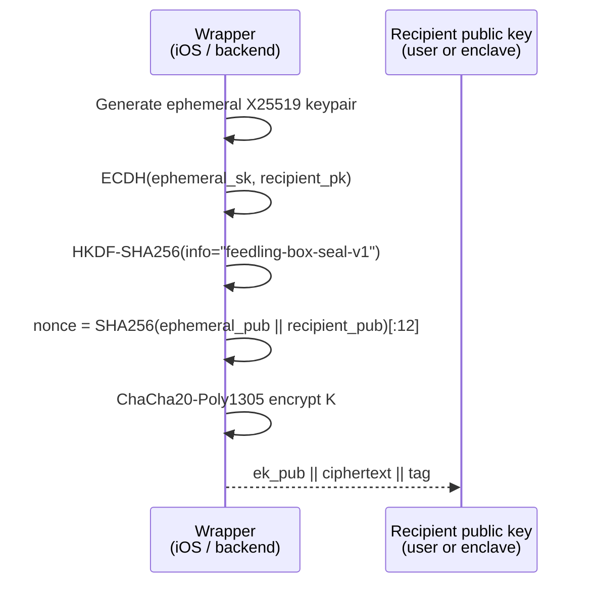
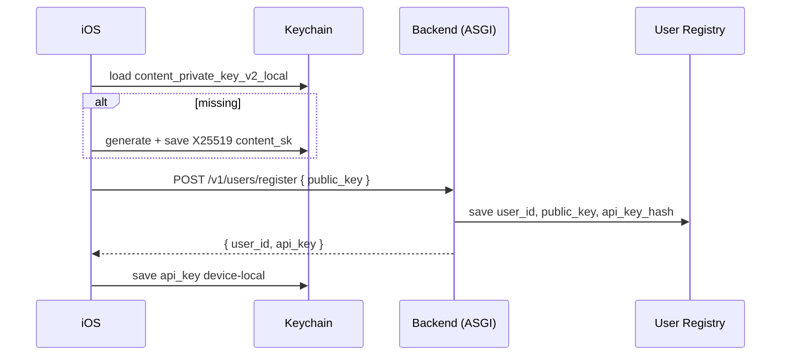
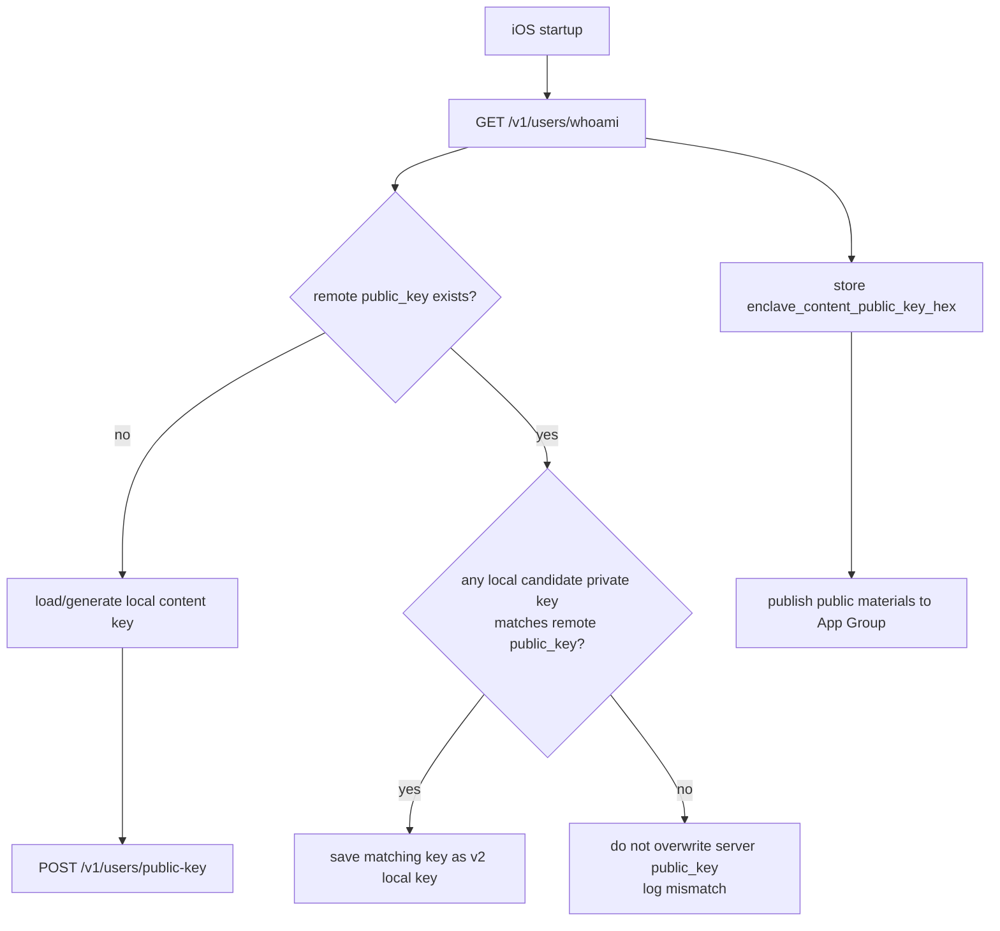
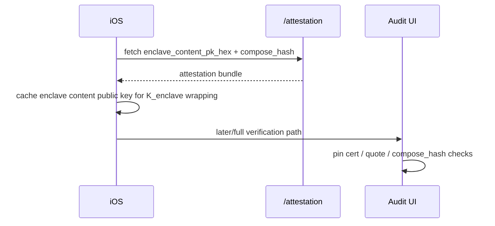
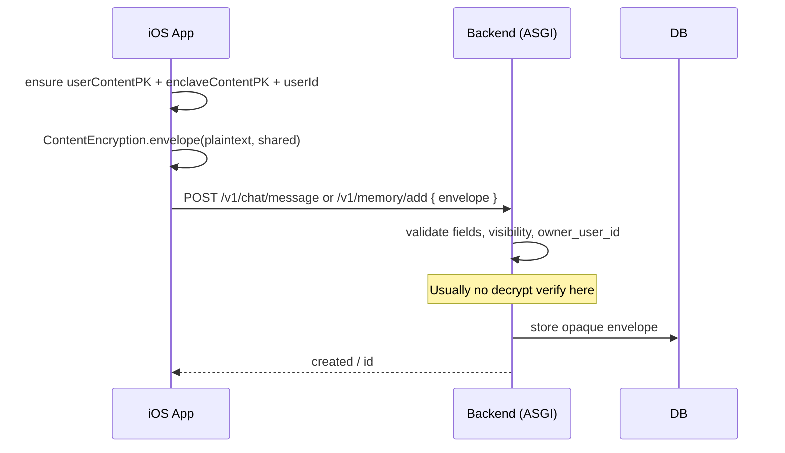
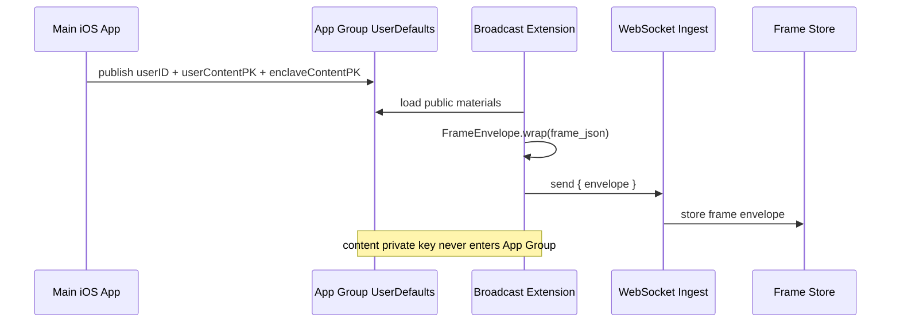
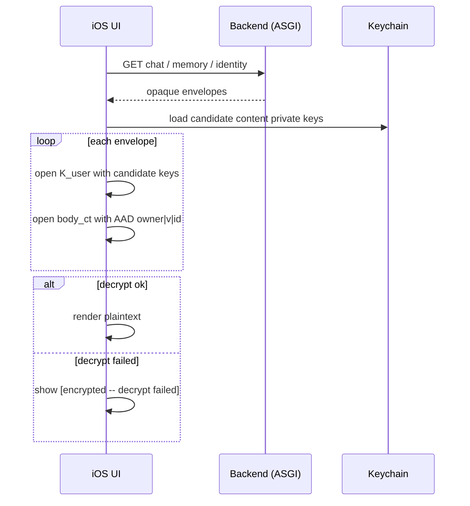
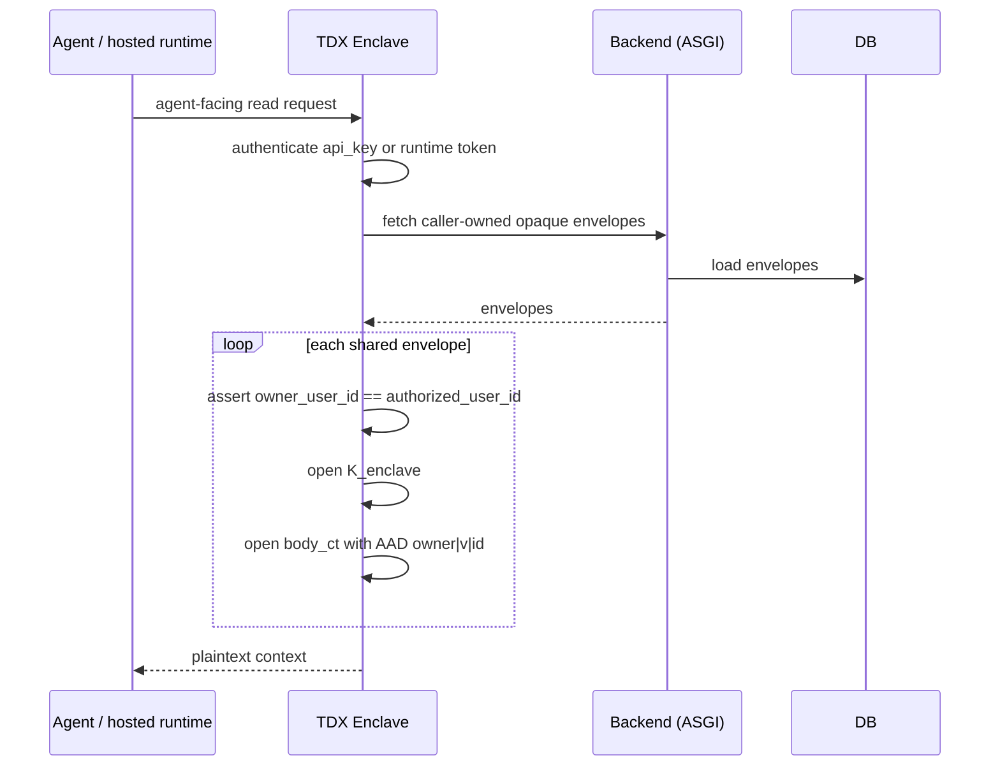
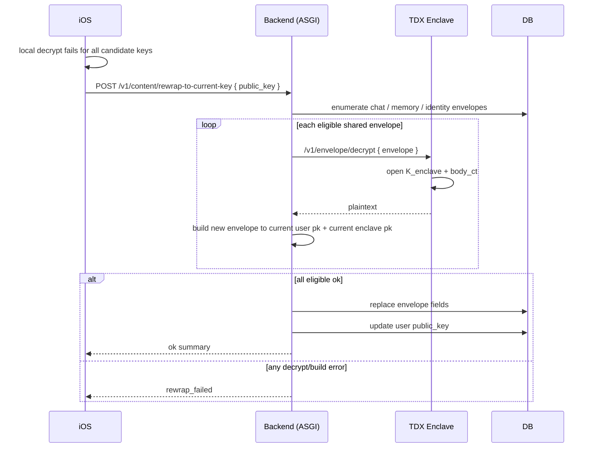
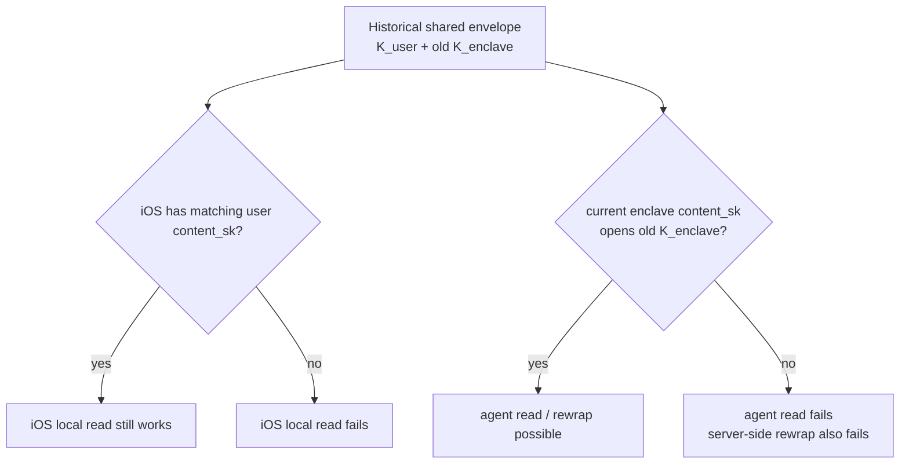

# Feedling 当前内容加密交互梳理

状态: current implementation note, 2026-07-03  
范围: 后端 `feedling-mcp` + iOS 前端 `feedling-mcp-ios` 的内容加密、解密、key 生命周期和恢复路径。  
注意: `docs/DESIGN_E2E.md` 是历史设计文档；当前 wire format 以代码为准。

---

## 1. 一句话模型

Feedling 的用户内容使用统一的 v1 envelope。

iOS 负责端上加密和本地解密；后端负责存储 envelope、分发 key material、阻止危险 public key 覆盖；enclave 负责 agent 侧解密和 rewrap 救援。

每条内容都有一个随机对称 key `K`:

- `body_ct`: 用 `K` 加密的正文。
- `K_user`: `K` sealed 给用户的 content public key，iOS 用 Keychain 私钥解。
- `K_enclave`: `K` sealed 给 enclave content public key，agent / hosted 路径经 enclave 解。

所以同一条 shared 内容有两个合法读者: 用户设备和 enclave。

```mermaid
flowchart LR
    IOS[iOS App<br/>content_sk in Keychain] -->|build v1 envelope| API[Backend (ASGI)<br/>stores ciphertext]
    API --> DB[(DB / object storage<br/>envelopes only)]
    API -->|opaque envelope| IOS
    IOS -->|open K_user locally| UI[User UI plaintext]

    Agent[Agent / hosted runtime] -->|agent-facing request| Enclave[TDX Enclave<br/>content_sk from dstack KMS]
    Enclave -->|fetch opaque envelopes| API
    API --> DB
    Enclave -->|open K_enclave| AgentPlain[Agent plaintext context]
```

---

## 2. Wire Format

典型 envelope:

```json
{
  "v": 1,
  "id": "16-byte-hex-item-id",
  "owner_user_id": "usr_...",
  "visibility": "shared",
  "body_ct": "base64(ciphertext||tag)",
  "nonce": "base64(12-byte nonce)",
  "K_user": "base64(box_seal(K, user_content_pk))",
  "K_enclave": "base64(box_seal(K, enclave_content_pk))",
  "enclave_pk_fpr": "optional-short-fingerprint"
}
```

`visibility`:

- `shared`: 有 `K_user` + `K_enclave`，用户设备和 enclave 都能读。
- `local_only`: 只有 `K_user`，enclave 和 agent 永远读不了。

```mermaid
flowchart TB
    Plain[plaintext body] --> BodyEnc[ChaCha20-Poly1305<br/>key K, nonce, AAD]
    BodyEnc --> BodyCT[body_ct = ciphertext || tag]

    K[random per-item K] --> UserWrap[BoxSeal to user_content_pk]
    K --> EnclaveWrap{visibility == shared?}
    UserWrap --> KUser[K_user]
    EnclaveWrap -->|yes| KEnclave[K_enclave]
    EnclaveWrap -->|local_only| NoEnclave[no K_enclave]

    Owner[owner_user_id] --> AAD["AAD: owner_user_id|v|id"]
    V[v] --> AAD
    ID[id] --> AAD
    AAD --> BodyEnc
```

正文 AEAD 的 AAD 是:

```text
owner_user_id|v|id
```

这意味着 owner、version、item id 任一漂移，解密时都会 AEAD verify fail。

---

## 3. 加密原语

正文加密:

- `K`: 每条内容随机 32 bytes / 256-bit symmetric key。
- `nonce`: 12 bytes。
- AEAD: ChaCha20-Poly1305 / CryptoKit `ChaChaPoly`。
- `body_ct`: `ciphertext || tag`，nonce 单独存。

Key wrapping (`K_user` / `K_enclave`):

1. 生成临时 X25519 keypair。
2. ECDH 得到 shared secret。
3. HKDF-SHA256, `info = "feedling-box-seal-v1"`, output 32 bytes。
4. nonce = `SHA256(ephemeral_pub || recipient_pub)[:12]`。
5. ChaCha20-Poly1305 加密 `K`。
6. 输出 `ephemeral_pub || ciphertext || tag`。

这不是 libsodium `crypto_box_seal` 的 wire format，而是 CryptoKit 友好的自定义 sealed-box 形态。后端、iOS 主 app、broadcast extension 必须保持完全一致。



主要实现:

- 后端 envelope builder: `backend/content_encryption.py`
- 后端 enclave opener: `backend/enclave_app.py` `_box_seal_open_hkdf` / `_decrypt_envelope`
- iOS 主实现: `../feedling-mcp-ios/App/FeedlingTest/API/ContentEncryption.swift`
- iOS broadcast 轻量复制: `../feedling-mcp-ios/App/FeedlingBroadcast/FrameEnvelope.swift`

---

## 4. 前后端交互流程

### 4.1 注册

1. iOS 生成或加载 content keypair。
2. iOS 调 `/v1/users/register`，上传 `public_key`。
3. 后端保存用户 content public key，返回 `user_id` 和 `api_key`。
4. `api_key` 只用于认证，不是内容加密 key。

iOS 当前主 content key 存在 device-local Keychain 槽:

- service: `com.feedling.mcp`
- account: `content_private_key_v2_local`
- accessible: `AfterFirstUnlockThisDeviceOnly`

旧同步槽 `content_private_key` 只作为 legacy 迁移和兜底解密候选。



### 4.2 启动 / whoami self-heal

iOS 调 `/v1/users/whoami`，后端返回:

- `user_id`
- 用户账号上的 `public_key`
- `enclave_content_public_key_hex`
- 其他偏好字段，如 `archive_language`

iOS 的处理策略:

- 如果远端 `public_key` 存在，iOS 会优先在本地候选私钥中找匹配 key；找到后把它保存为当前 v2 local key。
- 如果远端 `public_key` 为空，iOS 才把本地 public key backfill 到 `/v1/users/public-key`。
- 如果远端 `public_key` 和本地当前 key 不一致，iOS 不会强行覆盖远端 key，避免让旧密文永久不可读。
- 同时 iOS 记录 `enclave_content_public_key_hex`，后续写 shared envelope 时用它构造 `K_enclave`。



### 4.3 Attestation key refresh

iOS 也会从 `/attestation` 拉:

- `enclave_content_pk_hex`
- `compose_hash`
- `mrtd`

这个启动路径接受 enclave self-signed cert；注释里明确 full verification 在 Audit UI 路径做。实际加密写入依赖这里拿到的 `enclave_content_pk`。如果该 key 被替换，新的写入会 sealed 到新 key，旧数据是否还能解取决于 enclave 当前私钥是否仍能打开历史 `K_enclave`。



### 4.4 写入内容

主 app 写入:

- chat text / image: iOS 构造 envelope，POST `/v1/chat/message`。
- memory: iOS 构造 envelope，POST `/v1/memory/add`。
- identity: iOS 可传 envelope；部分 agent/server 路径也允许后端拿 plaintext 后 build shared envelope。
- perception sensitive signals: iOS 构造 envelope，放到 perception report item。
- photo perception: image bytes / metadata envelope。

Broadcast extension 写入:

- 主 app 把 `userID`、用户 content public key、enclave content public key 写入 App Group。
- broadcast extension 只拿 public material，不拿用户私钥。
- extension 用 `FrameEnvelope` 构造 shared frame envelope，通过 WebSocket 发 ingest。

后端写入层多数只校验:

- 必要字段存在。
- `visibility` 合法。
- `shared` 必须有 `K_enclave`。
- `owner_user_id` 匹配当前认证用户。

后端 API 层通常不解密。因此写入成功不等于之后一定可解密。如果 `K_enclave`、AAD、`id`、owner 或 enclave key 不匹配，读时才失败。





### 4.5 读取内容

用户设备读取:

1. iOS 从后端拉 envelope。
2. 用 Keychain 中候选 content private keys 依次打开 `K_user`。
3. 用得到的 `K` 和 AAD 打开 `body_ct`。
4. 解不开时 UI 标记 `[encrypted -- decrypt failed]`，不会静默丢行。

Agent / hosted 读取:

1. agent-facing 请求打到 enclave 服务。
2. enclave 认证 caller，解析 authorized user。
3. enclave 校验 `owner_user_id == authorized_user_id`。
4. enclave 用自己的 content private key 打开 `K_enclave`。
5. enclave 用 AAD 打开 `body_ct`。

这两条读路径彼此独立: iOS 本地解密不依赖 enclave；agent 读取不依赖用户私钥。





---

## 5. Key Drift 和 Rewrap

### 5.1 iOS local key drift

症状:

- iOS 无法用任何本地 / legacy candidate key 打开 `K_user`。
- UI 出现 `[encrypted -- decrypt failed]`。
- 但 shared envelope 仍可能能被 enclave 通过 `K_enclave` 打开。

恢复路径:

1. iOS 调 `recoverContentKeyDriftIfNeeded(reason:)`。
2. iOS POST `/v1/content/rewrap-to-current-key`，带当前本地 public key。
3. 后端遍历 chat / memory / identity 的 shared envelopes。
4. 后端请求 enclave 解旧 envelope。
5. 后端用当前用户 public key + 当前 enclave public key 重新 build envelope。
6. 全部 eligible items 成功后，后端更新账号 `public_key`。

限制:

- `local_only` 无法由后端 rewrap。
- 缺 `K_enclave` 的历史内容无法由后端 rewrap。
- 如果 enclave 当前 content private key 已经打不开旧 `K_enclave`，后端 rewrap 也救不了。



### 5.2 Enclave content key drift

症状:

- agent / enclave 解历史 shared envelope 失败。
- iOS 仍可能能用 `K_user` 本地解旧数据。
- 后端 rewrap 依赖 enclave 打开旧 `K_enclave`，因此也可能失败。

Router 背景里已有一条相关记录: prod 曾出现当前 enclave content key 和文档 baseline 不一致，历史 decrypt failures 倾向是 Phala / dstack KMS identity drift，而不是 AppAuth 授权或 app-level `get_key` 改动。

这个问题是部署/KMS 身份层风险，不是 iOS envelope primitive 本身的 bug。



---

## 6. API Key / Runtime Token 与内容加密的关系

`api_key`:

- 用于认证。
- 后端只存 `HMAC-SHA256(pepper, api_key)`。
- 明文不可从 DB 恢复。
- 不参与内容 envelope 加密。

iOS 当前把 cloud `api_key` 存在 device-local Keychain 槽，避免 iCloud Keychain transient miss 导致误注册新账号。

runtime token:

- hosted consumer 的短期 HMAC token。
- 目标是让 consumer 不持用户长期 API key。
- token 带 `user_id`、scope、TTL。
- 不参与内容 envelope 加密，只影响后端/enclave 认证。

Provider API key:

- `setupModelAPI(provider:model:apiKey:)` 当前从 iOS 明文 POST provider key 给后端配置端点。
- 这不是聊天内容 v1 envelope 路径。
- 后端负责后续封装/存储 provider key，并在 hosted runtime / enclave 路径解封。

```mermaid
flowchart LR
    APIKey[Feedling api_key] --> Auth[Authentication only]
    RuntimeToken[Runtime token] --> Auth
    Auth --> Routes[Backend / enclave route authorization]

    ContentKey[User content keypair] --> Envelope[v1 content envelope]
    EnclaveKey[Enclave content keypair] --> Envelope
    Envelope --> Data[chat / memory / identity / perception / frames]

    ProviderKey[Provider API key] --> Setup[/v1/model_api/setup]
    Setup --> ProviderStore[separate provider-key storage / unwrap path]
```

---

## 7. 当前边界和风险点

1. **写入层不做完整 decrypt verify。**  
   后端保存 envelope 前通常不验证 `K_user` / `K_enclave` 是否真的能打开。坏 envelope 可能入库，读时才暴露。

2. **Attestation fetch 和加密写入之间存在信任时序。**  
   iOS 启动路径为了拿 `enclave_content_pk` 接受 self-signed cert；完整 pinning / DCAP 检查在 Audit UI。若要把加密写入严格绑定 verified attestation，需要再收紧这条路径。

3. **`local_only` 是真正不可 agent 读。**  
   一旦写成 `local_only`，后端/enclave 没有 `K_enclave`，不能帮忙 rewrap，也不能给 agent。

4. **Enclave key drift 会影响历史 shared 数据的 agent 可读性。**  
   iOS 本地 `K_user` 仍可能读，但 agent / rewrap 都依赖当前 enclave 能打开旧 `K_enclave`。

5. **Broadcast extension 只拿 public material。**  
   这是正确边界；代价是 extension 无法本地解密，也无法自愈 private-key 问题。

6. **Provider key 配置不等同 E2E content envelope。**  
   用户聊天/记忆/身份/感知内容是端上 envelope；provider key setup 是配置密钥路径，需要单独审计。

---

## 8. 快速代码入口

后端:

- `backend/content_encryption.py`: Python envelope builder。
- `backend/core/envelope.py`: 后端 shared envelope helper、public key decode、enclave pk fetch。
- `backend/core/enclave.py`: 后端到 enclave 的 attestation / decrypt proxy。
- `backend/enclave_app.py`: enclave key derive、envelope decrypt、agent-facing decrypt-and-serve。
- `backend/content/routes.py`: public key update、content rewrap、content export。
- `backend/accounts/registry.py`: API key HMAC storage。
- `backend/core/runtime_token.py`: short-lived runtime token primitive。

iOS:

- `../feedling-mcp-ios/App/FeedlingTest/API/ContentEncryption.swift`: 主 app envelope build / unseal。
- `../feedling-mcp-ios/App/FeedlingTest/API/FeedlingAPI.swift`: content key store、whoami self-heal、attestation refresh、rewrap、export/reset。
- `../feedling-mcp-ios/App/FeedlingBroadcast/FrameEnvelope.swift`: broadcast extension frame envelope。
- `../feedling-mcp-ios/App/FeedlingTest/Pages/Chat/ChatMessage.swift`: chat 本地解密展示。
- `../feedling-mcp-ios/App/FeedlingTest/Pages/Chat/ChatViewModel.swift`: chat 发送前 secure context 准备和 envelope POST。
- `../feedling-mcp-ios/App/FeedlingTest/Pages/Settings/Perception/PerceptionPermissionsManager.swift`: sensitive perception signals envelope。
