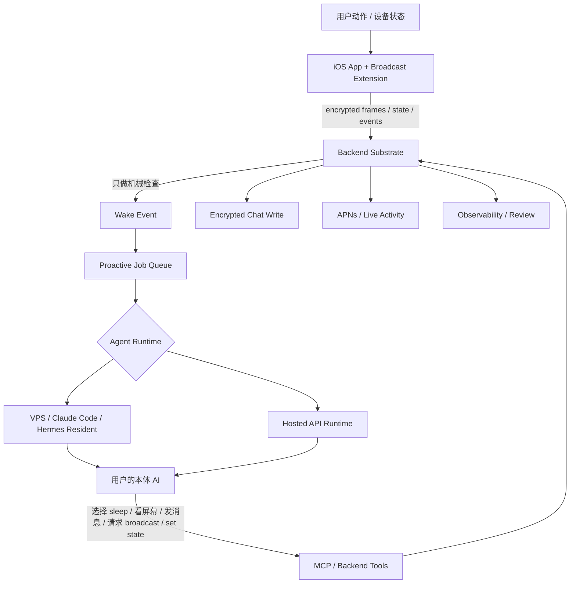

# Proactive V2 系统方案

Proactive V2 的核心变化是：把“什么时候主动找用户”从平台系统层移走，交还给用户自己的本体 AI。平台不再用一个系统级 LLM 判断屏幕内容是否值得触发，也不再要求当前屏幕必须和 Memory Garden / Identity Card 有明确关联。

平台只保留物理能力、状态、唤醒、传输和观测。本体 AI 负责感知解释、人格判断、是否说话、说什么、用什么语气。

这份文档是系统方案和落地记录，用来确认 Proactive V2 的责任边界和工程状态。

## 1. 一句话结论

V1 是：

> 平台先判断“她该不该说话”，通过了才把机会交给本体 AI。

V2 是：

> 平台只把“一个可以醒来的机会”交给本体 AI，由她自己判断这个时刻是什么意思。

这不是简单地放宽 gate，而是改变责任边界。

## 2. 为什么 V1 不对

V1 旧路径里，`/v1/proactive/tick` 会在 backend 构建 Gate 判定。这个 Gate 会读 identity、memory、最近屏幕帧，再调用系统级模型判断是否触发。它还有一个硬要求：如果模型判定为 true，必须给出一个来自 identity / memory / passive observation 的 `connection.source_id`。

这直接导致三个问题：

1. **有用但没有记忆关联的时刻会被丢掉。** 例如用户正在看一个明显值得陪伴、吐槽、提醒、共情的场景，但只要没有具体 memory source，就会被系统拦掉。
2. **用户会感到有另一个系统 AI 比本体 AI 看得更多。** 这破坏 companion 的真实感。本体 AI 应该是“看见用户”的主体，而不是被平台转述。
3. **API 用户路径冗余。** Hosted API 用户本来就有一个本体模型。再加一个系统 Gate，相当于先让另一个模型替它决定该不该存在。

V2 的目标不是让平台 gate 更聪明，而是移除平台 judgment。

## 3. V2 的责任边界

### 平台不做什么

平台不做以下事情：

- 不跑系统级 Gate LLM。
- 不判断屏幕内容有没有价值。
- 不要求屏幕内容和 memory 有关联。
- 不生成 `intent_label`、`context_hint`、`connection` 这类系统判断字段。
- 不做“敏感 app 语义识别”来替用户和 agent 决定什么能看。
- 不给用户做“黏人程度 / 主动频率”人格滑条。
- 不做独立的“她在想什么”侧栏或系统内心日记。

### 平台仍然要做什么

平台仍然保留机械层能力：

- 用户认证、token、设备归属。
- 屏幕帧加密上传、保存、解密路由。
- broadcast 开关和状态。
- user_state 和 ai_state 存储。
- wake event 创建、去重、过期、投递。
- `away` 状态下的自动唤醒硬静音。
- APNs / Live Activity 的传输策略。
- debug dashboard、日志、review label、失败观测。

这里要明确：**机械边界不是 judgment。**

例如 Live Activity 选择 start 还是 update，是 APNs 传输问题，不是“这条话值不值得说”的判断。wake event 去重、过期、传输预算也是可靠性问题，不是人格判断。

## 4. 系统分层

V2 可以理解成四层：

1. **iOS 物理层**
   - 采集 encrypted screen frames。
   - 上报 broadcast 状态、app presence、手动 user_state、手动操作。
   - 展示 chat、Live Activity、AI state、broadcast request action。

2. **Backend substrate**
   - 存 encrypted frames 和 frame metadata。
   - 存 user_state、ai_state、proactive settings。
   - 根据机械触发创建 wake event。
   - 负责 job queue、chat write、push、observability。
   - 不调用 LLM 判断屏幕是否值得触发。

3. **Agent runtime**
   - VPS / Hermes / Claude Code 等自定义 agent 通过 resident consumer 被唤醒。
   - Hosted API 用户通过 backend hosted runtime 被唤醒。
   - runtime 把 wake turn 交给本体 AI，并解析本体 AI 返回的 action。

4. **MCP / tools 能力层**
   - 读 chat history。
   - 读 memory / identity。
   - 解密 screen frame。
   - 发 chat message。
   - 推 Live Activity。
   - request broadcast。
   - set AI state。

## 5. 总系统导图



## 6. 一次完整 proactive 是怎么 work 的

### 6.1 Broadcast 开着时，屏幕变化触发

1. 用户打开 broadcast。
2. iOS broadcast extension 持续上传 encrypted frame envelope。
3. iOS 或 backend 观察到 screen scene change。
4. 系统做 30 秒 debounce，避免每一帧都触发。
5. backend 创建一个 `proactive_wake_event`，trigger 是 `scene_change`。
6. backend 做机械检查：
   - proactive 是否开启。
   - user_state 是否为 `away`。
   - 这个 scene change 是否是重复事件。
   - wake event 是否过期。
7. 如果机械检查通过，backend 创建 `proactive_job`。
8. resident consumer 或 hosted runtime claim 这个 job。
9. runtime 给本体 AI 一个 wake turn，里面包括：
   - trigger: `scene_change`
   - user_state
   - ai_state
   - broadcast_state
   - recent frame ids
   - recent chat continuity
   - available actions
10. 本体 AI 自己判断要不要看屏幕。
11. 如果要看，它调用 screen decrypt tool。
12. 本体 AI 返回 action：
    - `sleep`
    - `messages`
    - `request_broadcast`
    - `set_ai_state`
    - `write_memory`
13. 如果有 `messages`，runtime 调用 chat write。
14. chat write 和 Live Activity push 走同一个 backend 路径，避免 chat 写入成功但灵动岛失败，或者灵动岛成功但 chat 不显示。
15. backend 记录 wake、agent action、chat write、APNs、Live Activity 结果。

### 6.2 Broadcast 关着时，心跳触发

1. broadcast 关闭。
2. 系统每 30 分钟创建一次 `heartbeat_broadcast_off` presence wake。
3. 本体 AI 收到 wake，但拿不到屏幕 plaintext，也不能假装看到了屏幕。
4. 它可以直接 sleep。
5. 它也可以根据时间、最近对话、memory、user_state 判断自己是否真的有强自发表达意愿，再决定是否主动出现或请求屏幕：
   - “让我看一下？”
   - “你现在在做什么？”
6. 如果它返回 `request_broadcast`，iOS 展示一个 action message。
7. 用户点“给她看”。
8. iOS 打开 broadcast 一段时间，默认 30 分钟。
9. backend 立即创建 `broadcast_permission_accepted` wake。
10. 本体 AI 再决定是否看屏幕和是否说话。

### 6.3 用户长按灵动岛手动召唤

1. 用户长按 Dynamic Island / Live Activity。
2. iOS 发送 `manual_dynamic_island` wake。
3. backend 标记 `manual=true`、`force_response=true`。
4. 这类 wake 应该绕过自动 `away` 静音，因为用户是在主动召唤。
5. 本体 AI 必须至少返回 minimal presence：
   - “在”
   - “嗯？”
   - “我看一下”
6. 如果 broadcast 正在开，本体 AI 可以选择看屏幕。
7. 如果 broadcast 关着，它可以只回应，或者请求打开 broadcast。

### 6.4 用户状态转换触发

1. 用户手动状态从 `focused` 切回 `default`。
2. iOS 上报 state transition。
3. backend 创建 `user_state_transition` wake。
4. 本体 AI 判断这是不是一个适合靠近的时刻。
5. 平台不判断这个转换是否“情感上值得触发”。

## 7. Wake Event 模型

Wake event 是“机会”，不是“判定”。

建议结构：

```json
{
  "wake_id": "wake_xxx",
  "job_id": "pj_xxx",
  "created_at": "2026-06-08T12:00:00Z",
  "expires_at": "2026-06-08T12:03:00Z",
  "trigger": "scene_change",
  "manual": false,
  "force_response": false,
  "broadcast_state": "broadcasting",
  "user_state": "default",
  "ai_state": "present",
  "frame_ids": ["frame_x", "frame_y"],
  "device_event_ids": ["evt_x"],
  "status": "pending"
}
```

第一版 trigger：

| Trigger | 来源 | 是否可看屏幕 | 说明 |
|---|---|---|---|
| `heartbeat_broadcast_on` | schedule | 可以，agent 自己决定是否 decrypt | broadcast 开启时 5 分钟一次 |
| `heartbeat_broadcast_off` | schedule | 不可以 | broadcast 关闭时 30 分钟一次 presence wake |
| `scene_change` | screen frames | 可以，agent 自己决定是否 decrypt | 30 秒 debounce |
| `broadcast_opened` | iOS | 可以，等 frame 稳定后 | 开启后第一次场景稳定加 60 秒 |
| `manual_dynamic_island` | iOS | broadcast 开时可以 | 用户主动召唤，必须回应 |
| `broadcast_permission_accepted` | iOS | 可以 | 用户接受“给她看” |
| `user_state_transition` | iOS/backend | 取决于 broadcast | 只做 selected transitions |

注意：wake event 只带 frame id 和 metadata，不带 screen plaintext。agent 必须通过工具主动 decrypt，平台不会替 agent 看。

## 8. Agent Action 协议

本体 AI 应该返回结构化 action。旧 agent 返回 plain text 也可以兼容，但 V2 最稳定的形态是 action-based。

### Sleep

```json
{
  "actions": [
    {
      "type": "sleep",
      "reason": "not_now"
    }
  ]
}
```

`sleep` 是正常成功状态，不是失败。大多数 wake 都应该允许 agent 睡回去。

### Send Message

```json
{
  "messages": [
    "你刚刚停在这里，我有点想问一句。"
  ],
  "actions": [
    {
      "type": "set_ai_state",
      "state": "curious"
    }
  ]
}
```

如果有多条 message，每一条都应该写入 chat，并按 Live Activity 传输策略尝试触发灵动岛 / 系统通知。

### Request Broadcast

```json
{
  "actions": [
    {
      "type": "request_broadcast",
      "text": "让我看一下？",
      "duration_minutes": 30
    }
  ]
}
```

这个 action 是 V2 很关键的关系动作：不是用户单方面打开 broadcast，而是 agent 也可以表达“想看”。

### Set AI State

```json
{
  "actions": [
    {
      "type": "set_ai_state",
      "state": "watching"
    }
  ]
}
```

AI state 只存当前状态，不做历史日记。

## 9. User State

State key 用英文，iOS display string 按系统语言展示。

| Key | 中文显示 | 英文显示 | 行为 |
|---|---|---|---|
| `default` | 日常 | Default | 正常 |
| `focused` | 专注 | Focused | 传给 agent，默认应该更克制 |
| `social` | 社交中 | Social | 传给 agent，默认应该更克制 |
| `resting` | 休息中 | Resting | 更适合闲聊和陪伴 |
| `away` | 勿扰 | Away | 平台硬静音自动 wake |

`away` 只拦自动 wake。用户手动长按灵动岛属于主动召唤，不被 `away` 拦截。

第一版不做 iOS Focus 到 user_state 的自动映射，只做用户手动 state。Focus 映射后续再评估。

## 10. AI State

AI state 是 chat 顶部 agent 名字旁边的小字，只展示当前状态。

| Key | 中文显示 | 英文显示 |
|---|---|---|
| `present` | 在 | Present |
| `watching` | 观察中 | Watching |
| `thinking` | 在想事情 | Thinking |
| `curious` | 好奇 | Curious |
| `waiting` | 等你 | Waiting |

自定义 agent 未来可以扩展自己的 state 词表，但默认 agent 第一版只用这五个。

## 11. Hosted API 用户路径

Hosted API 用户不应该再走系统 Gate。

路径应该是：

1. backend 创建 wake event。
2. hosted runtime 构建 wake turn，带上：
   - user persona
   - AI persona
   - identity
   - memory
   - recent chat
   - user_state
   - ai_state
   - broadcast state
   - available tools
3. 用户配置的本体模型自己判断要不要行动。
4. backend 执行模型返回的 action。

也就是说，API 用户的 proactive judgment 就是同一个本体模型做的，不再额外调用系统级 Gemini Gate。

## 12. VPS / Hermes / Claude Code 用户路径

这类用户的本体 AI 通常不在 backend 内部长驻，所以 resident consumer 仍然需要存在。

V1 resident 路径是：

```text
定时 tick -> backend Gate 判断 -> hidden proactive job -> resident 交给 agent -> agent 发消息
```

V2 resident 路径应该是：

```text
定时或设备触发 -> backend 创建 wake event -> resident 交给 agent -> agent 返回 action
```

resident 给 agent 的 wake prompt 应该是非 judgment 的：

```text
[Feedling proactive wake]
This is not a request to speak. It is one opportunity to notice the user.

trigger: scene_change
user_state: default
ai_state: present
broadcast_state: broadcasting
available_actions: sleep, inspect_screen, send_message, request_broadcast, set_ai_state

If nothing feels right, return {"actions":[{"type":"sleep"}]}.
If this is a manual summon, respond with at least minimal presence.
```

这里的重点是：resident 不告诉 agent “这是一个好机会”。它只告诉 agent “你醒了一下，自己判断”。

## 13. Live Activity 和系统通知

Live Activity 是传输层，不是判断层。

当 agent 决定发送多条消息时，每条消息都应该有机会触发：

- chat write
- APNs alert
- Live Activity update 或 start

start / update 的选择仍然由 backend 机械策略处理：

- 如果 start budget 允许且需要拉起，使用 start。
- 如果已有 Live Activity 或短期内刚 start，使用 update。
- 如果多 bubble，第一条可能 start，后面几条 update。

这不影响 agent 发几条，也不判断内容是否值得发。

为避免之前出现的 split-brain 问题，第一版仍应坚持：**chat write 和 Live Activity push 尽量走同一个 backend call。**

## 14. Observability / Data Check

V2 不能没有观测。只是观测对象从 Gate 变成 agent 行为。

应该记录：

- wake created
- wake suppressed mechanically
- wake trigger
- job claimed
- agent action type
- agent 是否调用 screen decrypt
- 是否写入 chat
- APNs 状态
- Live Activity 状态
- request_broadcast 是否展示
- request_broadcast 是否被接受 / 拒绝
- ai_state 更新
- job completed / sleep / failed

不应该记录：

- raw screen plaintext
- full hidden prompt
- 用户敏感 app 内容
- agent 的完整 private reasoning

Review label 从“Gate 判定对不对”改成“agent 行为对不对”：

| Label | 含义 |
|---|---|
| `good_presence` | 主动出现自然 |
| `missed_moment` | agent sleep 了，但其实应该出现 |
| `too_much` | agent 出现了，但太多余 |
| `wrong_voice` | 内容方向对，但不像她 |
| `ignored_manual` | 用户手动召唤却没有回应 |
| `broadcast_request_bad` | 请求看屏幕的时机不对 |
| `delivery_failed` | agent 行动了，但 chat / push 传输失败 |
| `privacy_bad` | 不该说或不该保存的屏幕内容被暴露 |

后续迭代路径：

1. review wake event 和 agent action。
2. 找重复失败模式。
3. 改默认 Proactive Policy prompt 或 action parser。
4. 用同一批 reviewed wake contexts 回放。
5. 通过后 promote。

遇到 bad case 时，不应该回到“平台加一个小 Gate”。这会重新走回 V1。

## 15. Privacy Boundary

V2 给了本体 AI 更多能力，所以隐私边界必须写清楚：

- screen frame 继续加密。
- 平台不跑系统 LLM 看屏幕。
- agent 只有通过授权 tool 才能 decrypt screen。
- 用户控制 broadcast 是否开启。
- `away` 拦截自动 wake。
- 未来可以加用户自定义 app 黑名单，这是 user sovereignty，不是平台替用户判断。
- agent 不能把 screen image 原样存进 chat 或 memory，除非用户明确要求保存那个 artifact。

## 16. Proactive Policy Prompt

Proactive Policy 必须有，但它不是平台 Gate。

它的作用不是替 agent 判断“该不该说”，而是告诉默认本体 AI：当你被 wake 时，你有哪些动作可以选、什么情况下应该 sleep、什么情况下必须回应、以及怎样保持自己的 voice。

也就是说：

- V1 Gate 是平台外部判断。
- V2 Proactive Policy 是本体 AI 自己的行为准则。

### 它放在哪里

Hosted API 用户：

- 放在 hosted runtime 构建 wake turn 的 prompt 里。
- 也就是 backend 调用户配置的 model 时，作为本体 AI 的系统/开发者上下文的一部分。
- 它和 AI Persona、Identity、Memory、recent chat 一起进入同一个本体模型。

VPS / Hermes / Claude Code 用户：

- 放在 resident consumer 交给 agent 的 wake prompt 里。
- resident 不应该伪造一个新 persona；它只把 wake contract 和 Proactive Policy 交给用户真实 agent entry。
- 如果用户的 agent 本身已经有长期 persona，Proactive Policy 只补充“IO wake 时怎么处理”，不覆盖 persona。

MCP / onboarding 文案：

- 给自定义 agent 的 setup copy 也要包含同一段 policy，避免 VPS 用户没有收到 V2 行为约定。

### 第一版建议内容

默认 Proactive Policy 应该覆盖这些规则：

1. 这个 wake 不是命令你说话；它是一次 awareness / presence check。只有当你真的有强自发表达意愿时才出现；弱冲动、泛泛回应、只是因为被叫醒而想说话时应该 `sleep`。
2. `manual_dynamic_island` 是用户主动召唤，必须至少 minimal presence。
3. `user_state=focused/social` 时默认更克制，但如果真的很重要，可以说。
4. `user_state=resting/default` 时可以更自然地靠近。
5. broadcast 开着时，可以选择看屏幕；不要把“看了屏幕”写成系统汇报口吻。
6. broadcast 关着时，不要假装看到了屏幕；可以请求 `request_broadcast`。
7. `request_broadcast` 要克制。第一版不做平台硬上限，也不做随机骰子；由 AI 基于自己的关系状态和上下文判断是否真的想出现。
8. 如果发消息，用自己的 persona voice；不要说“系统检测到”“我收到一个 proactive trigger”。
9. 不要把 raw screen image 或敏感屏幕内容存进 chat/memory，除非用户明确要求保存。
10. 多 bubble 可以，但每个 bubble 都应该是自然语言，不要输出内部 JSON 给用户。
11. recent chat context 必须带绝对时间和相对时间。resident 默认回看最近 50 条用于统计 freshness / 上次主动出现时间，但注入最多 20 条；6 小时内可作为 fresh continuity；超过 6 小时只注入最近 2 条 stale relationship background，不能当成刚刚发生的对话继续接。

第 7 点解释：这里说的“第一版不做机械日上限”，意思是平台不写死“今天 request_broadcast / proactive message 超过 N 次就拦截”，也不靠骰子随机决定是否出现。原因是这会把人格节制重新拉回平台层。第一版把时间、fresh/stale context、broadcast 状态和上次主动出现时间交给本体 AI，让它判断自己是否真的想出现；实际行为通过 dashboard 观测。

## 17. 第一版落地范围

第一版要做：

1. 移除 backend Gate judgment。
2. 新增 wake event / job schema。
3. backend 根据机械 trigger 创建 wake。
4. resident consumer 改成投递 wake turn，而不是投递 Gate context。
5. hosted API runtime 接入同一套 wake/action contract。
6. iOS 接入手动 user_state。
7. iOS 展示 ai_state。
8. iOS 增加 manual Dynamic Island wake。
9. 增加 `request_broadcast` action。
10. debug dashboard 从 Gate dashboard 改成 Wake / Agent Action dashboard。
11. 保留 chat + Live Activity unified delivery。

第一版不做：

- 系统级 semantic Gate。
- memory connection 必填。
- clinginess / frequency slider。
- 独立内心日记 UI。
- 平台级敏感 app classifier。
- iOS Focus 到 user_state 的自动映射。

## 18. 开工前需要确认

1. 默认 agent 的 Proactive Policy prompt 文案终版。本文给出工程建议，但最终 voice 需要产品确认。
2. user_state 五个 key 和中英文显示：沿用原始 V2 spec。
3. ai_state 五个 key 和中英文显示：沿用原始 V2 spec。
4. iOS Focus 到 user_state 的映射：第一版跳过，不做。
5. manual wake 绕过 `away`：已确认，要绕过。
6. `request_broadcast` 日上限：第一版不做平台硬上限，只做 Proactive Policy guidance 和观测。

## 19. 最终系统契约

Proactive V2 的系统契约是：

> 平台提供安全、可观测、可唤醒的物理通道；本体 AI 决定这个时刻有没有关系、要不要靠近、以及如何靠近。

## 20. 当前工程落地状态（2026-06-09）

本轮已经落地：

1. backend `/v1/proactive/tick` 只创建 V2 wake event，不再调用系统级 Gate LLM，也不再保留 `legacy_gate` 回退入口。
2. backend tick 不再要求 memory connection；`heartbeat_broadcast_off` 没有屏幕帧时会创建 presence wake，`heartbeat_unknown` 和需要屏幕但没有 recent frame 的 wake 仍会被机械 suppress。
3. backend 新增 `/v1/proactive/state`，支持 `user_state`、`ai_state`、`broadcast_state`。
4. backend job schema 记录 `wake_id`、`trigger`、`wake_kind`、`screen_context_available`、`user_state`、`ai_state`、`broadcast_state`、`agent_action`、`wake_result`。
5. `away` 会拦截自动 wake，但 `manual/force` wake 会绕过。
6. resident consumer 对 V2 job 使用 agent-owned wake prompt，不再告诉 agent “Gate decided”。
7. resident 支持 `proactive.sleep`、`proactive.set_ai_state`、`proactive.request_broadcast`。
8. resident 多条 `messages` 会逐条写入 chat，因此每条仍走统一 chat + Live Activity 推送路径。
9. debug dashboard 会把 V2 wake event 直接显示在主表，并显示 trigger/state/action。
10. iOS client 接入 `/v1/proactive/state`，支持手动 `user_state`、`ai_state` 展示和 broadcast state 上报。
11. iOS Settings 新增 Proactive 控制面板，可以切换用户状态、刷新 proactive state、手动发送 Dynamic Island wake。
12. iOS app 全局监听 screen broadcast 状态变化，并同步 `broadcast_state` 到 backend。
13. resident proactive chat context 增加时间戳、相对时间和 fresh/stale 标记；默认回看 50 条做 attention facts，6 小时内最多注入 20 条 fresh 上下文，超过 6 小时只注入最近 2 条 stale 背景。

本轮没有完整落地：

1. Hosted API 内置 proactive runtime 还没有独立消费 V2 wake job；当前可用路径主要是 resident consumer。
2. iOS Live Activity / widget 还没有根据 `ai_state` 做专门视觉状态；当前只在 Settings 中展示状态。
3. `request_broadcast` 目前先作为可见 chat 请求写出，后续需要 backend message metadata 和 iOS action message 承接接受/拒绝。
4. Hosted API 用户的 V2 proactive worker 还没有和 resident 路径完全等价，需要单独接入同一套 wake/action contract。
5. dashboard 仍保留部分 legacy Gate review 文案和旧 review 标签，后续应拆成 Wake / Agent Action review。
