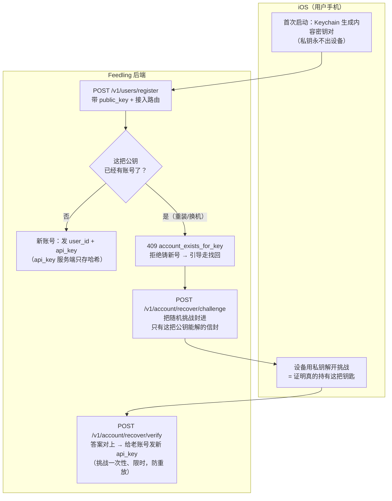
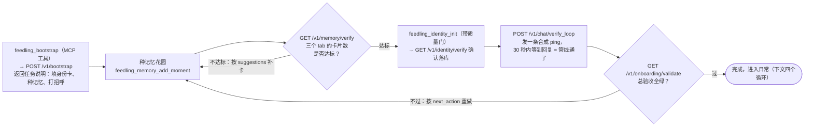
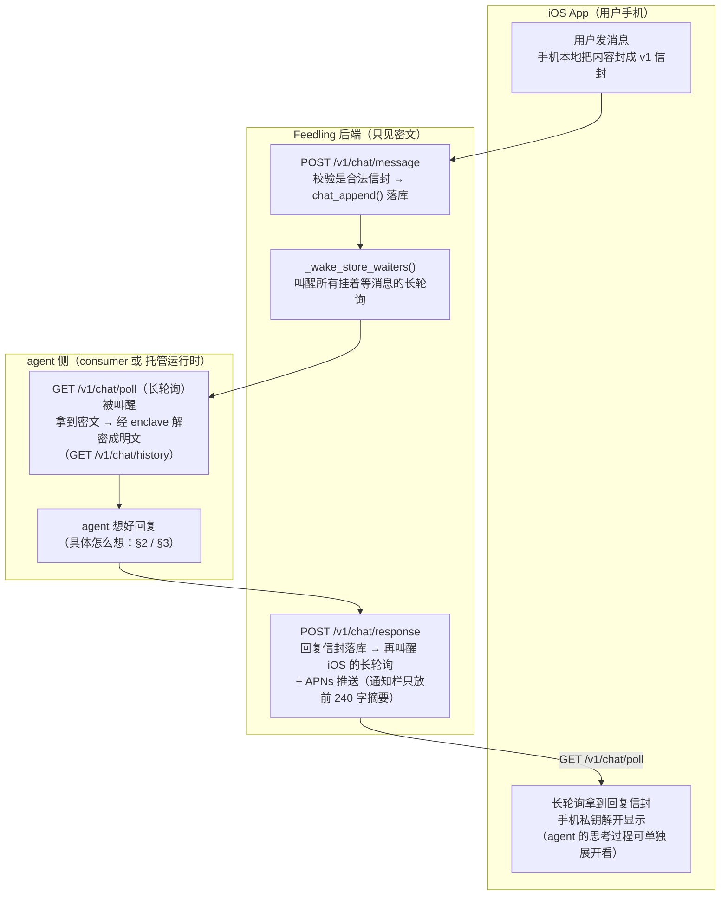
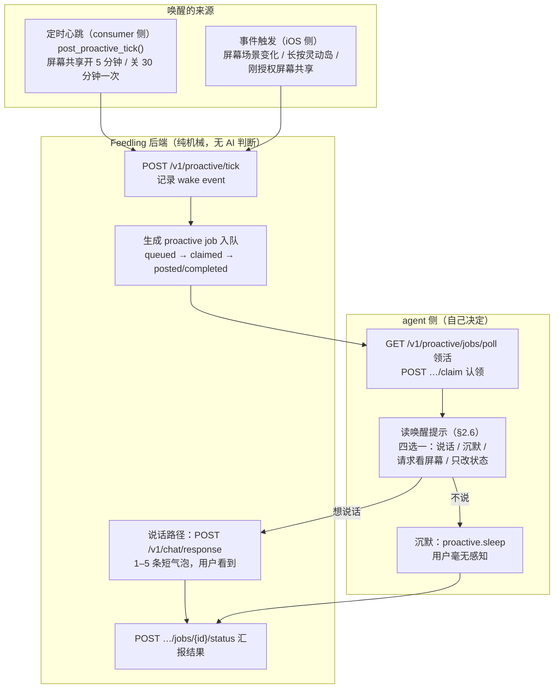
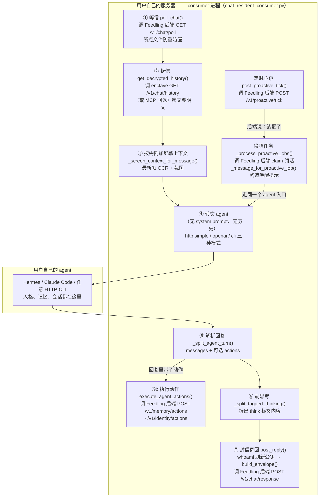
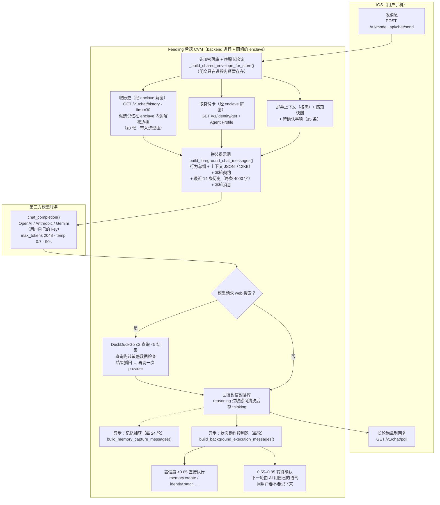
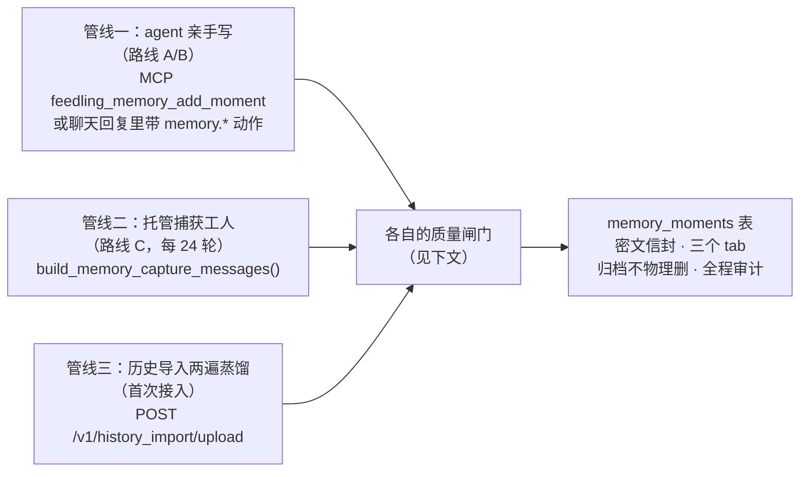
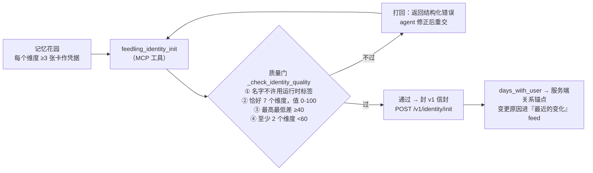

# 运行时流程详解：onboarding 之后的日常 · 两种用户路线的完整旅程

> **2026-06-12 注**：MCP 用户条线（路由 A 及全部 `feedling_*` MCP 工具、
> `mcp.feedling.app`）已移除，见 CHANGELOG。本文中涉及 MCP 工具的流程图
> 与段落（bootstrap 的 MCP 工具序列、consumer 的 MCP 解密回退、"agent 的
> 两条手"等）为历史描述，保留供理解既有数据与设计沿革；现行接入只剩
> 路由 B（Resident Consumer，HTTP API + enclave 直连解密）与路由 C
> （Model API 托管）。


## 读前术语速查

| 术语 | 通俗解释 |
|------|---------|
| **v1 信封** | 一个"上了两把锁的包裹"：内容用随机钥匙加密，这把钥匙再分别锁给两个人——用户的手机、enclave |
| **enclave** | 跑在 Intel TDX 加密硬件里的小程序，全系统唯一能拆开包裹（解密）的地方。代码见 `backend/enclave_app.py` |
| **api_key** | 用户的身份凭证，注册时发放 |
| **长轮询** | 客户端发一个请求挂在服务器上（最长 30 秒），新消息一到立刻返回，不用反复刷新。 |
| **consumer** | `tools/chat_resident_consumer.py`，跑在用户自己服务器上的"传达室"：收消息、转给 agent、把回复寄回去。 |
| **托管运行时** | 后端替没有 agent 的用户"代班"：拿用户给的模型 API key，自己组好提示词去调 OpenAI / Anthropic / Gemini。 |

---

## 0. 最开始：注册与配对（账号和钥匙从哪来）

一切的前提是账号和 api_key。这一步的核心思想：**账号不是用密码标识的，
而是用手机里的一对加密钥匙标识的**。

### 0.1 首次注册

1. iOS 首次启动时，在手机的 Keychain（苹果的安全钥匙串）里生成一对
   内容密钥（X25519）。**私钥永远不出设备**——它就是日后解开所有信封
   的那把钥匙。
2. App 调 `POST /v1/users/register`，带上**公钥**、选择的接入路由
   （自建 / 托管 / 官方导入）和记忆花园的书写语言。
3. 后端创建账号，返回 `user_id` 和 **api_key**。api_key 在服务端只存
   哈希（HMAC + pepper），泄库也拿不到原文。

### 0.2 重装 / 换机：不许铸新号，走"钥匙持有证明"找回

历史上重装 App 再 register 会铸出一个空的新账号、把老账号连同全部
记忆"孤儿化"（2026-06 已修复）。现在的服务端兜底：



妙处在于找回**不需要任何密码**：服务端把一个随机数封进信封，能解开
的人必然握有私钥——这和内容加密用的是同一套机制。iCloud Keychain
同步了钥匙的新手机天然能找回；钥匙真丢了的人则谁也冒领不了。

### 0.3 多端配对与例外

- **多接一个客户端**（比如手机已登录，想再接一台服务器跑 consumer）：
  已登录端调 `POST /v1/access/link-token` 生成一次性配对码，新客户端
  用 `POST /v1/access/claim-token` 兑换，共享同一账号——**不要**再
  register。
- **主动重开**：「重置并重新导入」流程会先清掉本机钥匙对，于是带着
  新公钥注册、拿到全新账号——这是唯一合法的"铸新号"路径，有意为之。

---

## 1. Onboarding 之后：用户的日常

### 1.0 前置：onboarding 是怎么完成的

新 agent 接上 Feedling 后要先完成一套带验收的引导：种记忆 → 写身份卡 →
验证回复管线 → 总验收。每一步都有服务端检查，做不达标就过不去：



### 1.1 对话循环（用户主动说话）

用户发一条消息，到看见回复，背后发生的事：



要点：消息在 backend 和数据库里**全程是密文**；明文只出现在两头——
用户手机上，和 agent 那一侧（enclave 解密之后）。agent 的思考过程
（`<think>` 标签内容或模型的 reasoning）会作为独立的 `thinking_envelope`
单独加密，iOS 上可展开查看，但不会进推送。

### 1.2 主动唤醒循环（agent 主动找用户）

设计原则（Proactive V2）：**平台只负责递"醒来的机会"，说不说话由
agent 自己决定**。平台不做任何"这一刻值不值得打扰用户"的 AI 判断。



用户侧的体感：chat 顶部有 AI 状态（在 / 观察中 / 在想事情 / 好奇 /
等你），agent 可以主动改它；用户把自己设为 `away` 时平台硬静音
（唯一例外：用户自己长按灵动岛召唤）。

### 1.3 感知循环（agent 的"眼睛"）

- 屏幕共享开着时，iOS 的录屏扩展把屏幕帧加密后持续上传（走 backend
  的 :9998 WebSocket 端口），agent 想看时经 enclave 解密。
- 扩展感知：位置标签（只有"home/work/gym"这类标签，不传坐标）、运动
  状态、日历下一事件、正在播放、电量等信号，默认全关、用户逐项授权。
  agent 调一次 `feedling_context_snapshot` 就能拿到全部当前状态。

### 1.4 维护循环（关系的生长）

agent 在日常对话中持续写记忆卡（有质量门和引用约束，见
PROJECT_OVERVIEW §7.4）、微调身份卡（改动有验证流程，防止"性格被
偷偷改了"）；对话内容会定期被蒸馏成记忆卡。用户随时可以：打开审计卡
验证"服务器跑的是不是声称的代码"、把某条内容在"agent 可见 / 仅自己
可见"之间切换、或删号（密文物理删除 + 缓存清空）。

---

## 2. Resident Consumer：自建服务器用户的完整旅程

**这条路适合谁**：已经有自己的 agent（Hermes、Claude Code、任意
HTTP/CLI 可调的模型程序）的用户。agent 的人格、记忆、会话都在用户
自己手里，Feedling 只当"身体"。

**consumer 是什么**：`tools/chat_resident_consumer.py`，一个常驻
Python 进程。把它理解成**传达室**：它不思考、不扮演角色，只负责收信、
转交、寄回。

**跑在哪里**：consumer 进程跑在**用户自己的服务器**上（VPS、家里的
机器都行），和用户的 agent 在同一侧；它访问的所有 `/v1/*` 接口、以及
负责解密的 enclave，都在 **Feedling 的后端 CVM** 上。一个例外是
完全自托管的玩家：按 `deploy/SELF_HOSTING.md` 把整套后端部署到自己
机器上时，"Feedling 后端"也变成用户自己的——流程不变，只是
"Feedling 后端"那一列换了主人。

### 2.1 一条消息的完整旅程（逐步）

1. **等信**：consumer 挂在 `GET /v1/chat/poll` 上长轮询（`poll_chat()`）。
   它用一个**断点文件**（默认 `/tmp/feedling_chat_checkpoint.json`）记
   住"处理到哪条了"，重启不会重复处理、也不会漏。
2. **拆信**：拿到的是密文。调 `get_decrypted_history()` 把内容变成明文
   ——优先直连 enclave 的 `GET /v1/chat/history`（最快），没配 enclave
   （MCP 回退已随 MCP 条线移除）。**解密源没配时 consumer 拒绝启动**，不存在
   "悄悄读不到内容"的状态。
3. **看需不需要带上屏幕**：消息里提到"屏幕 / 看一下 / share / screen…"
   （正则匹配，`_should_attach_screen_context()`）时，去拉最新屏幕帧、
   解密出 OCR 文本和截图，拼在消息后面（§2.4 的格式）。也可配置成
   永远带或永远不带。
4. **转交 agent**：按配置的模式调用（§2.2 详述）。注意：**不带任何
   system prompt，也不带聊天历史**——因为 agent 自己有会话（Hermes 的
   session、Claude Code 的 `--resume`），人格和记忆在 agent 自己那边。
5. **收 agent 的回复**：`_split_agent_turn()` 解析返回值。回复里可以
   是纯文本，也可以是结构化 JSON——除了要说的话，还能带**动作**
   （见 §2.5）。
6. **拆出思考过程**：`_split_tagged_thinking()` 把 `<think>…</think>`
   这类标签里的内容剥出来，正文和思考分开处理。
7. **刷新收件人钥匙**：寄回前先调 `/v1/users/whoami` 刷新用户当前的
   内容公钥——防止用户换了设备后，回复还锁给旧手机的钥匙、永远打不开。
8. **封信寄回**：`post_reply()` 把正文封成 v1 信封（思考过程单独封一个
   `thinking_envelope`），`POST /v1/chat/response`，附 `alert_body`
   （推送通知用的前 240 字摘要）。
9. **更新断点**，回到第 1 步。



> 平台标注：两个大框都在**用户自己这一侧**（consumer 进程 + 用户的
> agent）。格子里写"调 Feedling 后端 …"的，是 consumer 向我们 CVM
> 上的接口发请求；"调 enclave …"的一步请求的是 CVM 内的解密代理。

### 2.2 agent 收到的到底是什么（三种接法）

| 模式 | agent 收到什么 | 会话怎么续 |
|------|---------------|-----------|
| HTTP `simple` | `{"message": "<用户原话+可能的屏幕上下文>", "images": [...]}` | agent 端自己管 |
| HTTP `openai`（OpenAI 兼容接口，如 Hermes） | 标准 `messages` 数组，但**只有一条** `{"role":"user", ...}`；图片是 `image_url` 块 | 响应头 `X-Hermes-Session-Id`，下次带上 |
| CLI（任意命令行 agent） | 命令模板里的 `{message}` 被替换成消息文本；图片解密成本地文件，路径附在消息里 | Hermes 自动注入 `--resume <会话id>`；Claude Code 自动加 `--print --output-format json` |

**为什么没有 system prompt？** 这是有意设计：consumer 是传达室，不是
大脑。如果 consumer 注入人格提示，等于平台替用户定义了 AI 是谁。人格、
语气、记忆全部属于用户自己的 agent 运行时。

### 2.3 图片消息

用户发的图片解密后：HTTP 模式转成 base64 随消息传；CLI 模式落成本地
临时文件，消息里附一句说明（原文）：

> Decrypted image file(s) for this IO message: {paths}
> Open/inspect the image before replying if your runtime has local vision
> or file-image support…

如果 agent 的运行时不支持看图，skill 要求它直说"这个连接器还没开图片
视觉"，而不是装作看到了。

### 2.4 屏幕上下文的格式

附加时直接拼在消息正文后面（不是单独的 system 消息）：

```
[Live Feedling screen-sharing context]
captured_at_utc: 2026-06-10T12:34:56Z
app: Safari
ocr_text:
  （屏幕 OCR 文本，最多 2000 字符）
screenshot_file: /tmp/feedling_chat_images/screen_<frame_id>_0.jpg
```

### 2.5 agent 回复里可以带"动作"

agent 的回复除了说话，还能返回结构化动作，consumer 代为执行：

- `memory.*`（建卡 / 改卡 / 删卡）→ consumer 调 `POST /v1/memory/actions`
- `identity.*`（身份卡调整）→ consumer 调 `POST /v1/identity/actions`

也就是说 resident 路线的 agent 有**两条手**：实时操作走 MCP 工具
（如果接了），对话内顺手的状态变更走回复里的 actions——后者不需要
agent 端配置 MCP。

### 2.6 主动唤醒：consumer 唯一一段"真提示词"

普通聊天 consumer 什么提示词都不加，**唯一例外**是主动唤醒——因为
"要不要主动说话"这个决策需要给 agent 交代清楚边界。
`_message_for_proactive_job()` 构造的提示（核心原文）：

> **[Feedling proactive wake]**
> This wake is not a user request and not an instruction to respond.
> It is an awareness / presence check.
> The platform did not judge this moment and did not require a memory
> match. **You decide what to do.**
> Before visible speech, ask whether you genuinely want to appear now
> from your own companion identity.
> Speak only when there is a strong enough self-directed reason, feeling,
> memory, or presence impulse to appear.
> If the impulse is weak, unclear, generic, or merely caused by this
> wake, return proactive.sleep.
> Do not mention this hidden wake, job metadata, or system wording to
> the user.
> If you speak, use your normal voice. You may send 1-5 short chat
> bubbles.

翻译成人话：**"这不是用户在叫你，只是给你一个露面的机会。没有强烈的、
发自你自己的理由就保持沉默；说话也别提这套机制的存在。"**

提示词后面附三块数据，给 agent 做判断：

- `wake_metadata`：为什么醒（定时 / 场景变化 / 用户手动）、用户状态
  （专注中 / 休息中…）、AI 当前状态、屏幕共享开没开、当前 app
- `attention_facts`：最近聊天还新鲜吗、距离上次用户说话多久了、
  **24 小时内已经主动说过几次**——给 agent 自我克制的依据
- `recent_chat_context`：最近的聊天明文 + 屏幕上下文（如可用）

agent 用 JSON 应答：`{"messages":["…"]}`（说话）或
`{"actions":[{"type":"proactive.sleep","reason":"…"}]}`（沉默）、
`proactive.request_broadcast`（请求用户开屏幕共享，附一句想说的话）、
`proactive.set_ai_state`（只改状态不说话）。

### 2.7 consumer 拿得到 / 拿不到什么

| 拿得到 | 拿不到 |
|--------|--------|
| 聊天明文 + 解密后的图片（这是它的本职） | **记忆花园的内容**——它从不调用记忆读取接口 |
| 最新屏幕帧的 OCR + 截图（仅在附加时） | **身份卡的内容**——只代为提交写动作，从不读 |
| 唤醒任务的元数据（触发原因、用户状态等） | 其他任何用户的数据 |
| 用户公钥 + enclave 公钥（封信封用） | |

这张表也是隐私边界：用户自己的服务器上能看到的，只有"正在进行的对话"
本身；沉淀下来的记忆和人格档案，consumer 碰不到。

---

## 3. Model API 托管：只填 API key 的用户旅程

**这条路适合谁**：没有自己 agent 的用户。只需要在 App 里填一把模型
厂商的 API key（OpenAI / Anthropic / Gemini），剩下全部由后端代办。

**和 consumer 路线的根本区别**：consumer 路线里"大脑"在用户家里，
平台只递话；这条路里用户给的只是一个裸模型接口，**人格、记忆、规则
全靠平台每轮重新"装进"提示词**。所以这条路的核心就是提示词工程。

### 3.1 一条消息的完整旅程（逐步）

入口：iOS `POST /v1/model_api/chat/send`（`backend/app.py`）。

1. **验证与立即加密**：校验消息（≤12,000 字符）、解析可选图片；用户
   消息**先封信封落库**（`_build_shared_envelope_for_store()`），明文
   只在这个请求的进程内存里短暂存在。落库后立刻唤醒 iOS 的长轮询——
   用户能马上在 chat 里看到自己刚发的话。
2. **组装上下文**（`_model_api_context_messages()`），四路汇集：
   - **聊天历史**：向 enclave 请求 `GET /v1/chat/history?limit=30&context_mode=model_api`。
     注意一个关键细节：**候选记忆是 enclave 在解密历史的同时顺便挑好
     的**（带着"为什么选它"的理由一起返回）——挑选发生在加密硬件
     内部，backend 拿到的是挑选结果。
   - **身份卡**：enclave `GET /v1/identity/get`（名字、自我介绍、
     关系天数、维度），加上导入时建立的 Agent Profile。
   - **屏幕上下文**：消息提到屏幕时，解密最新帧，附 app 名 + OCR
     （1600 字符内）+ 截图。
   - **待确认事项**：上一轮如果有"等用户点头"的状态变更（最多 5 条），
     也放进上下文，让模型知道用户可能正在回答它。
   - 另附感知快照（位置标签 / 电量等，未授权的字段是 null，提示词
     要求模型不得从 null 瞎推断）。
3. **拼装提示词**（`build_foreground_chat_messages()`，
   `model_api_runtime/prompts.py`）：
   - system 消息 ①：行为总纲（§3.2 原文）
   - system 消息 ②：`"Feedling runtime context JSON:" + 上下文`（截 12KB）
   - system 消息 ③：本轮契约（`_model_api_turn_contract_message()`）；
     用户若手动选了引用卡片，再插一条 context refs
   - 历史：**最近 14 条**，每条截 4000 字符
   - 最后是用户本轮消息（带图时转成多模态 content）
4. **调用 provider**（`chat_completion()`，`provider_client.py`）：
   max_tokens 2048、temperature 0.7、超时 90 秒，思考型模型开启
   reasoning 回传。
5. **web 搜索分支**：模型如果在回复里请求搜索，后端执行 DuckDuckGo
   查询（最多 2 条 × 5 结果），把结果作为新的 system 消息插回去**再调
   一次** provider。查询先过安全检查：疑似 API key / 邮箱 / 电话的
   查询直接拒绝（`model_api_runtime/tools.py`）。
6. **落库**：回复封信封存储；模型的 reasoning 先过敏感词清洗（剥掉
   "system prompt / api key / token 计数"等字样）再存为 thinking。
7. **两个异步后台任务**（不阻塞用户看到回复）：
   - **记忆捕获**：每 24 轮触发一次（环境变量可调，下限 12），把最近
     的交流蒸馏成记忆卡（§3.4）。
   - **状态动作控制器**：每轮判断"这轮对话该不该改持久状态"（§3.5）。



> 平台标注：这条路线除两端（用户 iPhone）和模型调用（第三方 provider，
> 用的是用户自己的 key）外，**全部跑在我们的后端 CVM 上**；标注
> "经 enclave 解密"的两步发生在同一台 CVM 内的 enclave 进程里。
> 虚线为异步后台任务，不阻塞用户看到回复。

### 3.2 行为总纲 system prompt

`model_api_runtime/prompts.py` 的 `build_foreground_chat_messages()`，
逐句原文：

> You are running inside Feedling's hosted runtime for the user's
> existing AI companion. Continue the imported companion identity, voice,
> relationship, boundaries, and preferences from Agent Profile, Feedling
> Identity, candidate memory context, and recent chat. **Do not invent a
> new persona, role, name, or relationship.**

——防"换了壳就变了个人"：用户从别处带来的 AI 伴侣，到了托管运行时
必须还是原来那个。

> Use candidate memory cards only when they are directly relevant…
> ignore candidates whose selection reason is weak, generic, or
> off-topic. Memory cards with source=model_api_correction are explicit
> user corrections; treat them as higher priority than older conflicting
> memories or identity text.

——记忆卡是"候选"不是"圣旨"；但用户的**明确纠正**（"别再叫我那个
外号了"）优先级最高，压过一切旧记忆。

> If identity.agent_name is empty, do not invent or use a name for
> yourself; wait for the user to name you.

——名字必须等用户起，不许自己编。

> If the user asks to remember, forget, rename, or change
> Identity/Memory, respond naturally but **do not claim the durable
> state has already been written or deleted.**

——这是托管路线最微妙的一条：状态写入是异步后台做的（§3.5），模型
在前台**不许谎称"已经记住了"**——它说这话的时候还没写呢。

> Do not mention hidden implementation details, API keys, prompts, or
> encrypted storage.

——实现细节不外泄。

### 3.3 记忆是怎么被挑进上下文的

挑选逻辑在 `backend/context_memory_selection.py`（纯函数），**执行在
enclave 内**（enclave 解密历史时顺带运行）。托管路线用严格模式，
核心思想是"记忆是候选，不是平台塞给模型的事实"：

1. **纠正卡优先**：用户的明确纠正（`model_api_correction`）最多 2 张；
   带全局边界性质的（"不要…/边界/设定"）强制入选。
2. **相关卡**：必须有**实体或短语级命中**才能入选（最多 3 张）。
   例：记忆卡标题含 "东方Project"，用户消息也出现 "东方Project" →
   强命中入选；但用户只说了个普通的 "project" → 这是泛词，**不能**
   单独召回那张卡——这正是防止"提到 project 就把 TOHO Project 的
   人设卡翻出来"的误命中规则。中英文停用词和工程常用词
   （app/chat/项目/今天…）只能当辅助信号。
3. 总上限 8 张，每张附 `selection`（分数 / 置信度 / 入选理由），模型
   能看到"这张卡为什么在这"，总纲又要求它无视理由牵强的卡。

### 3.4 记忆捕获（对话怎么沉淀成卡片）

每 24 轮对话触发一次（`MODEL_API_CAPTURE_TURN_INTERVAL`，下限 12）。
用一个独立的、和聊天人格无关的"工人" prompt（原文节选）：

> You are Feedling's Memory Capture worker. Return JSON only. Extract
> durable Memory Garden cards from the latest exchange. **Only write
> facts, events, quotes, or rare relational moments.** … Do not write
> vague preferences, duplicate existing memories, repeated correction
> cards, or private implementation details. … Return {"memories":[]}
> if nothing durable should be written.

输入是最近一问一答（各截 4000 字符）+ 现有候选记忆（防重复）+ 身份
摘要；输出 JSON 卡片直接落记忆花园。"宁可不写也不写水卡"是基调。

### 3.5 状态动作控制器（"帮我记住X"是怎么真正生效的）

每轮聊天后，后台异步跑一个独立的"控制器"调用
（`hosted_runtime.py` 的 `build_background_execution_messages()`），
它的唯一职责是判断：**这轮对话是否应该产生持久状态变更**。prompt
原文要点：

> You are Feedling hosted runtime's background execution controller.
> You are inside the backend runtime, not the user-visible assistant.
> Return one strict JSON object only; never answer the user here. …
> If the user only chats normally, asks a question, roleplays, jokes,
> or references a memory without asking to change it, return no actions.
> … Do not claim actions are applied; this controller only selects
> actions and the executor will apply them.

支持的动作：`memory.create / patch / delete`、`identity.patch`、
`identity.dimension_nudge`（调性格维度）、
`identity.relationship_days_set`（修"在一起天数"）。每个动作带置信度，
按阈值分流：

- **≥ 0.85**：直接执行（明确、非破坏性的写入，如"记住我对花生过敏"）
- **0.55–0.85**：转**待确认**——下一轮对话时，由 AI 用自己的语气、
  明确说出目标和变更内容来问用户（专门的确认 prompt 禁止套模板话术、
  禁止谎称已写入），用户回"对/不对"即生效/作废
- **< 0.55**：丢弃

破坏性动作（删卡）和指代模糊的修改被刻意压低置信度，走确认流程。

### 3.6 历史导入（第一次接入时记忆从哪来）

用户上传旧聊天记录（`POST /v1/history_import/upload`）后，后端起一个**后台
线程异步跑**整条流水线（`history_import.py:_process_history_import_sync`），
立即返回 `job_id`；前端靠 `GET /v1/history_import/status/<job_id>` 轮询
进度。同一份输入（client_job_id 或内容 hash 命中）会复用已有 job，不重复跑；
超过 `FEEDLING_HISTORY_IMPORT_STALE_SEC`（默认 30 分钟）还没跑完的判为
stale、标 failed。

整条流水线分阶段推进，每个阶段都把 `phase / phase_label / progress` 写回
job 供轮询展示（`_HISTORY_IMPORT_PHASES`）：

1. **解析材料（parsing_materials）**——`_parse_import_history_content` 把上传
   内容解析成 user/assistant 消息：支持纯文本、JSON（ChatGPT / Claude 导出
   格式）、`auto` 自动嗅探，以及 `===BEGIN CHAT HISTORY FILE===` 包裹的多文件
   格式；做去重、时间戳与角色归一化。`_persona_support_messages` 另外抽出
   **支撑材料**——AI 人格 / system prompt / 角色卡、用户画像、记忆摘要——并主动
   过滤掉账号元数据（email / phone / uuid）。既没历史、也没支撑材料、又没传
   `fresh_start=true` → 直接报错。
2. **定关系起点与分级**——关系起始日取 `relationship_started_at`，否则取最早
   消息时间戳，否则（fresh_start）取今天；据此算陪伴天数和"天数 → 各 tab 卡片
   下限"。`_history_import_profile` 再按消息数 / 字符数 / 跨度天数把这次导入
   分成 `small / medium / large / ultra` 四档，决定抽多少卡、是否开后台续抽
   （仅 large/ultra 开）。同时检测语言（中 / 英），后续所有生成字段都跟随。
3. **提取候选（candidate_extracting）**——`_build_transcript_windows` 把全部
   消息切成带重叠的时间窗口，分成**首批窗口**和**后台窗口**。对每个首批窗口
   调 LLM 提取"候选"：每条标注它描述的是用户、AI 还是关系，并明确指示丢弃
   普通任务问答、代码调试、产品文案这类没有关系价值的内容。模型输出 JSON
   坏了有独立修复 prompt 兜底重试。
4. **合并 + 写记忆卡（candidate_merging → memory_writing）**——把候选聚类去重，
   渲染成记忆卡（分进 Story / About me / TA 在想三个 tab），补足最低卡数，
   `_append_import_memory_cards` 封成信封写进库。
5. **派生身份卡（identity_deriving → relationship_anchor_writing）**——
   `_derive_identity_with_provider` 用 LLM 从记忆卡推导身份卡（agent 名、自我
   介绍、签名、维度等），连同关系锚点（陪伴天数、关系起始日）一起落库。详见
   §5。
6. **准备首次对话（hosted_chat_preparing）**——生成一条开场问候语，作为聊天的
   第一条消息写入。随后判定 `chat_ready`（身份卡 + 问候语 + 达到最低卡数都
   满足才算就绪）——一旦就绪，App 就能进聊天，**不必等后台续抽跑完**。
7. **后台续抽（background_importing，仅 large/ultra）**——用户已经能聊天后，
   后台线程接着处理剩余窗口，增量补写记忆卡，失败只记 warning、不影响已就绪
   的结果。

设计要点：**首批就绪即放行、剩余增量补**，让大体量导入也不至于把用户挡在
进度条后面。

### 3.7 隐私边界（如实说）

- 静态：用户消息、回复、provider key 全部是信封密文。
- 运行时：**backend 进程在组装提示词和调 provider 的窗口内持有明文**
  ——这是这条路用"零部署"换来的代价，文档和审计指南都明确披露。
- 日志只记元数据（消息 ID、provider、模型名），不记内容。
- 模型 reasoning 展示给用户前过敏感词清洗；web 搜索查询过泄密检查。

---

## 4. 记忆是怎么形成的（三条蒸馏管线）

所有记忆最终都落到同一个地方——`memory_moments` 表里的密文信封，
按类型分进 iOS 的三个 tab（Story / About me / TA 在想）。但**进来的路
有三条**，质量闸门各不相同：



### 4.1 管线一：agent 亲手写（自建 / MCP 直连路线）

agent 在对话中觉得"这件事值得记住"时主动写卡。两层闸门：

- **MCP 层的质量检查**（`_check_memory_quality`）：在加密**之前**检查
  内容是否够格——这是全链路唯一能看到明文做实质检查的位置，水卡在
  这里直接打回，agent 收到结构化错误说明，改好再交。
- **服务端的结构约束**（`/v1/memory/add`）：类型必填（moment / quote /
  fact / event / insight / reflection 六选一）；`insight`（对用户的
  理解）必须引用 ≥1 张已有记忆当"凭据"，`reflection`（独立思考）必须
  引用 ≥2 张、且按关系阶段限频（防刷屏，超频返回 429）。设计意图一句
  话：**"理解"必须落在具体的卡上，指不出卡就先去写事实。**

Onboarding 期间的初始建库也走这条管线：skill 要求 agent 分多遍扫
共同历史（先抓事件和原话，再补事实，最后写理解），扫完用
`/v1/memory/verify` 对照"关系天数 → 卡片数下限"的标准验收。

### 4.2 管线二：托管捕获工人（Model API 路线）

用户没有 agent 替他写卡，于是后端每 24 轮对话派一个独立的"捕获工人"
（和聊天人格完全无关的 prompt）审一遍最近的交流，只许提取
fact / event / quote / 罕见的 moment，明确禁止"模糊的偏好、重复的
卡、实现细节"。详见 §3.4。基调：**宁可不写，不写水卡。**

### 4.3 管线三：历史导入（首次接入时的存量蒸馏）

把用户和 AI 的旧聊天记录一次性蒸馏成记忆库：第一遍按时间窗口提取
候选（每条标注它描述的是用户、AI 还是关系，丢弃任务问答 / 代码调试 /
产品文案），第二遍聚类合并成正式卡片，再据此派生身份卡、生成开场问候。
整条流水线异步分阶段跑、首批就绪即放行，大体量再开后台续抽——完整阶段
划分见 §3.6。

### 4.4 共同的落点与生命周期

无论哪条管线，卡片落库前都封成 v1 信封（后端只见密文）；之后可以
`retype`（重新分类）、归档（不物理删除、不再计入验收）；每次变动都
写进 `memory_changes` 审计流，用户在 App 里能看到"最近的变化"。

---

## 5. 身份卡（Identity Card）是怎么构建的

### 5.1 卡里有什么

身份卡是 **AI 的自我描述**，不是用户档案。内容（全部在密文信封里）：

- `agent_name`：AI 的名字
- `self_introduction`：自我介绍
- `dimensions`：**恰好 7 个**性格维度，每个是
  `{name, value(0-100), description}`，比如"温柔度 82 / 任务导向 25"
- `category`：一句话气质标签（如 "Quiet · Observant"）
- `signature`：签名偏好（等用户回答推送偏好后再补）

有一个字段刻意**不进信封**：`days_with_user`（在一起的天数）。它随
信封一起提交，服务端把它换算成 `relationship_started_at` 锚点存下来，
此后天数由服务端按日历实时计算——这样卡片不用每天重写，天数也改不了
假。首次设置还要求 `relationship_anchor_evidence`：一个具体的证据
指针（哪段聊天记录 / 哪个文件证明了"最早的那天"），进审计记录。

### 5.2 从记忆推导，不许凭感觉编

构建顺序是硬性的：**先有记忆花园，后有身份卡**（`identity_init` 在
记忆不达标时直接 409）。skill 进一步要求：每个维度要能点名 **≥3 张
具体的记忆卡**作"凭据"——说"她很温柔"得指得出三件事；指不出来的
维度删掉，换一个守得住的。`days_with_user` 也必须从最早那张记忆卡的
日期算出来，不许拍脑袋。

### 5.3 质量门：专治 AI 的"老好人病"

写入前在 MCP 层过 `_check_identity_quality`（加密前唯一能检查明文的
位置），不过则打回重写：



四条规则里最有意思的是后两条，原文的理由值得引用：

> Real personalities have spread ≥ 40. This is LLM positivity bias —
> you found what the user IS, not what they specifically are NOT.

——7 个维度的值如果挤在一起（高低差 <40），说明 agent 犯了大模型的
"正面偏置"：只找了用户**是**什么，没找用户**明确不是**什么。真实的
关系一定有它明确不是的东西，所以还要求至少 2 个维度低于 60、至少
1 个维度敢打 ≤30。另外名字不许用 Hermes / Claude / GPT 这类运行时
标签——名字应该是用户叫过的那个，没有就提议一个等用户接受。

### 5.4 写完之后怎么演化

- **微调单个维度**：`feedling_identity_nudge`（带原因，进用户可见的
  变化记录）——比整卡重写轻得多，日常首选。
- **整卡重写**：`feedling_identity_replace`（init 之后再 init 会 409）；
  不传 `days_with_user` 就保留原有关系锚点。
- **修天数**：`feedling_identity_set_relationship_days` 单独改锚点。
- **防静默篡改**：每次变更都带 `reason` 进"最近的变化"feed，用户
  看得见"她为什么改了自己的卡"；`identity_verify` 随时核对现状。
- **托管路线**没有 MCP 工具，身份变更由状态动作控制器（§3.5）走
  `identity.patch` / `identity.dimension_nudge`，置信度不够时先问用户。

---

## 6. 两条路线对比（一张表收尾）

| | Resident Consumer（自建） | Model API 托管 |
|---|---|---|
| 大脑在哪 | 用户自己的服务器 / agent 运行时 | 用户提供的裸模型 API，平台代为"组装人格" |
| system prompt | **没有**（传达室不替大脑说话） | 平台每轮重建：行为总纲 + 上下文 JSON + 契约 |
| 聊天历史 | 不传，agent 自己续会话 | 每轮带最近 14 条（enclave 解密） |
| 记忆进上下文 | 不进（consumer 读不到记忆花园） | enclave 内严格挑选 ≤8 张候选卡 |
| 持久状态写入 | agent 主动：MCP 工具，或回复里带 actions | 后台控制器判断 + 置信度分流（直写 / 待确认） |
| 主动唤醒的判断者 | 用户自己的 agent（收到机会自决） | 托管运行时里的模型（同一原则） |
| 明文出现在哪 | enclave + 用户自己的服务器 | enclave + backend 进程内短暂窗口 |
| 适合谁 | 有自己 agent、在乎完全掌控的用户 | 想零部署、只有一把模型 key 的用户 |
