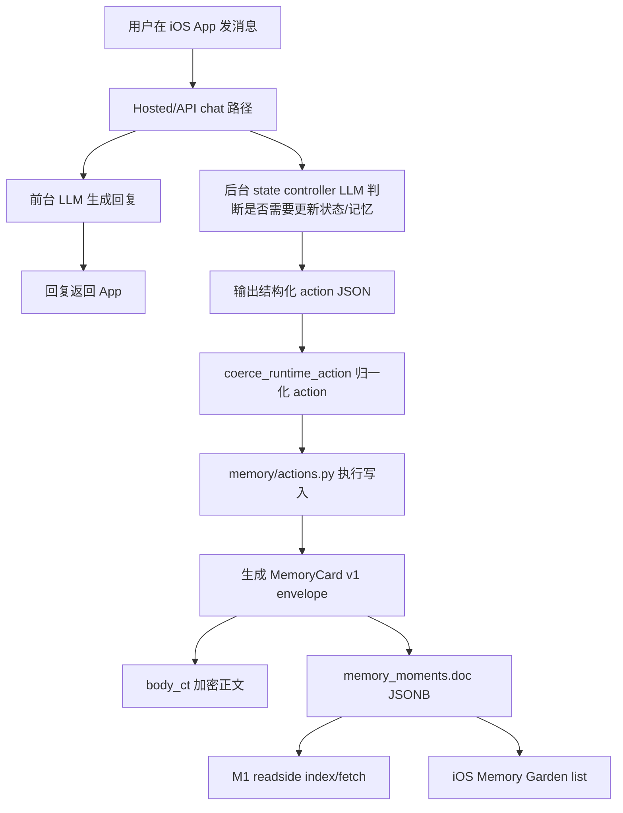

# IO Memory M2 写入闭环详细实现说明（Codex）

日期：2026-06-22  
作者：Codex  
面向读者：Seven / zhihao / leader 的 agent / 后端 reviewer / 后续执行 agent  
当前状态：M2 已合入 test 分支并完成基础回归；本文用于解释 M2 到底做了什么、代码怎么落、用户能看到什么、还有哪些问题留给 M3。

## 0. 一句话结论

M1 解决的是“agent 怎么读记忆”：先看 index，再 fetch 正文。  
M2 解决的是“agent 怎么写记忆”：后台 controller 判断需要写记忆后，产出结构化 action，服务端把它写成 MemoryCard v1，并且在用户纠正旧事实时用 `memory.supersede` 软退旧卡。

人话：M1 是“查记忆的路修好了”，M2 是“写记忆和改旧记忆的路修好了”。这次不是在做记忆质量优化，也不是在做 eval；它主要是把工程管道打通，让记忆可以按新结构稳定写进去、读出来、被旧 iOS Garden 继续展示。

## 1. 背景：为什么需要 M2

在 M1 之前，服务端记忆更多是“能存、能读”，但 agent 使用时不够清楚：

- recall 会从 memory 里找内容，但数据结构里没有统一的 v1 卡片语义。
- 旧 Garden 依赖 legacy 字段，比如 `title`、`description`、`her_quote`。
- 新 readside 更希望使用 `summary`、`verbatim`、`status`、`salience`、`importance`。
- 用户纠正旧事实时，不能直接硬删旧卡，否则会丢审计链路，也容易影响用户显式删除语义。

M2 的目标是补上写入闭环：

- 新增或升级记忆时，写成 MemoryCard v1 超集。
- 同一张卡同时兼容新 readside 和旧 iOS Garden。
- 用户纠正旧事实时，不删旧卡，而是把旧卡标记为 `superseded`，新卡变成 active。
- M1 recall 默认只用 active 新卡，不再把被取代的旧卡拿出来干扰回答。

人话：以前像是“记忆能塞进去，但塞进去长什么样不够统一”。M2 后，记忆像标准卡片一样写进去，而且旧卡被新卡替代时有明确退场机制。

## 2. 本轮 M2 的边界

本轮做：

- hosted/API 路径的写入闭环。
- `memory.create` / `memory.add` 写入 MemoryCard v1。
- `memory.patch` 保持新旧字段同步。
- `memory.supersede` 软替换旧卡。
- 与 M1 readside 打通：默认 recall 不返回 superseded 旧卡。
- 保持 iOS Memory Garden 不坏。

本轮不做：

- 不做 route A / MCP 路径完整改造。
- 不做 eval 自动化。
- 不做 merge / contradict / decay。
- 不做大规模历史数据迁移。
- 不新建表。
- 不改 iOS Garden UI。
- 不保证自然聊天里的所有事实都能被正确提取成 memory。

人话：M2 是“工程管道”，不是“记忆质量大脑”。比如用户随口说“我养了条狗叫蛋子”，这类自然事实是否一定被记下来，属于 M3 的提示词、eval、提取策略问题；M2 只保证一旦后台 action 决定要写，写入结构是对的。

## 3. 用户视角：上线后应该看到什么变化

用户不会看到一个新 UI，但会看到记忆行为更稳定。

### 3.1 新记忆写入

当后台 controller 判断用户说的是一条应该长期保存的事实、偏好、关系或纠正时，会写入一张新的 MemoryCard v1。

例子：

```text
用户：我喜欢在海边，海边会让我平静。
后台 controller：判断这是长期偏好，产出 memory.create。
服务端：写入一张 active memory。
之后用户问：我喜欢什么样的地方？
agent：可以从 memory recall 到“用户喜欢海边”。
```

### 3.2 旧事实被纠正

当用户明确纠正旧事实时，系统应该写入新卡，并把旧卡软退场。

例子：

```text
旧记忆：用户的猫武松是狸花猫。
用户：不对，武松其实是橘猫。
后台 controller：产出 memory.supersede。
服务端：新建“武松是橘猫”的 active 卡；旧“狸花猫”卡变成 superseded + archived。
之后用户问：武松是什么猫？
agent：应该回答橘猫，不再用狸花猫。
```

### 3.3 Garden 兼容

iOS Garden 目前还是读旧字段：

- `title`
- `description`
- `her_quote`

M2 写入时会在密文正文里双写：

- `summary` 同步到 `description`
- `verbatim` 同步到 `her_quote`

所以旧 Garden 不需要改 UI，也能继续展示新写入的卡。

人话：新系统需要 `summary/verbatim`，老界面需要 `description/her_quote`。M2 不是让两边各存一套，而是在同一个加密正文里双写，保证它们看到的是同一件事。

## 4. 整体链路



关键点：

- 前台 LLM 负责回复用户。
- 后台 controller LLM 负责判断是否需要写 memory。
- M2 不是让前台回复模型直接写数据库，而是让它输出 action，再由服务端 executor 执行。
- 记忆正文仍在 `body_ct` 里加密。
- 明文字段只放路由、状态、排序、兼容所需的 envelope metadata。

人话：用户先收到回复；后台再像“整理员”一样看这轮对话要不要记一笔。如果要记，它不会直接乱写文本，而是发一个结构化指令，后端按规则写入。

## 5. 代码实现地图

### 5.1 `backend/hosted_runtime.py`

职责：定义后台 controller 能说哪些 action，以及把模型输出转换成 executor 能执行的 action。

核心改动：

- 在 `build_background_execution_messages(...)` 里补充 `memory.supersede` 协议。
- 明确 `memory.supersede` 的格式：
  - `target.memory_id` 指向旧卡。
  - `payload.memory` 放新卡内容。
- 在 `coerce_runtime_action(...)` 里把模型输出转成内部 action。
- 支持这些 memory action：
  - `memory.create`
  - `memory.add`
  - `memory.add_correction`
  - `memory.patch`
  - `memory.supersede`
  - `memory.replace`
  - `memory.correct`
  - `memory.delete`

示例：后台 controller 可能输出的 `memory.create`：

```json
{
  "type": "memory.create",
  "confidence": 0.82,
  "payload": {
    "memory": {
      "type": "preference",
      "summary": "用户喜欢在海边，海边环境会让用户平静。",
      "verbatim": "我喜欢在海边，海边会让我平静。",
      "context": "用户在聊天中表达的长期偏好。"
    }
  }
}
```

被 coerce 后会变成 executor 更容易处理的形状：

```json
{
  "type": "memory.add",
  "confidence": 0.82,
  "memory": {
    "type": "preference",
    "summary": "用户喜欢在海边，海边环境会让用户平静。",
    "description": "用户喜欢在海边，海边环境会让用户平静。",
    "verbatim": "我喜欢在海边，海边会让我平静。",
    "her_quote": "我喜欢在海边，海边会让我平静。",
    "context": "用户在聊天中表达的长期偏好。",
    "source": "hosted_runtime_state"
  }
}
```

示例：后台 controller 可能输出的 `memory.supersede`：

```json
{
  "type": "memory.supersede",
  "confidence": 0.9,
  "target": {
    "memory_id": "mem_old_cat_001"
  },
  "payload": {
    "memory": {
      "type": "fact",
      "summary": "用户的猫武松是橘猫。",
      "verbatim": "不对，武松其实是橘猫。",
      "context": "用户纠正了之前关于武松品种的记忆。"
    },
    "reason": "user_correction"
  }
}
```

人话：`hosted_runtime.py` 是“让模型说标准话”的地方。模型不能随便说“帮我改一下记忆”，它必须说出一个可执行的 JSON action。

### 5.2 `backend/hosted/turn.py`

职责：在一次 hosted/API 对话结束后，启动后台状态整理，并把 action 交给 memory executor。

核心流程：

```text
_model_api_plan_state_actions(...)
  -> 调用用户配置的 provider/model/key
  -> 使用 build_background_execution_messages(...) 生成后台 controller prompt
  -> 解析模型返回 JSON
  -> coerce_runtime_action(...)
  -> 得到可执行 actions

_execute_model_api_state_plan(...)
  -> 区分 identity actions 和 memory actions
  -> 给 memory actions 补 source_chat_message_ids
  -> 调用 memory/actions.py 的 _execute_memory_actions(...)
  -> 写 state receipt

_start_model_api_state_action_job(...)
  -> 在前台回复后后台执行
```

注意：

- 后台整理使用的是用户配置的模型和 key，不是服务端固定模型。
- 它发生在前台回复之后，所以用户先看到回复，memory 写入是异步补上的。
- 如果同一个用户已经有后台 state job 在跑，会避免重复并发跑一堆整理任务。

人话：一次聊天不是只有“回复用户”这一步。回复之后，后台还会开一个整理任务，决定这句话要不要变成记忆。

### 5.3 `backend/memory/actions.py`

职责：真正写 memory、patch memory、supersede memory。

核心新增/升级点：

#### `_memory_inner_from_action(data)`

把 action 里的 memory 内容整理成加密正文。

密文正文内会写：

```json
{
  "title": "用户喜欢在海边",
  "description": "用户喜欢在海边，海边环境会让用户平静。",
  "summary": "用户喜欢在海边，海边环境会让用户平静。",
  "verbatim": "我喜欢在海边，海边会让我平静。",
  "her_quote": "我喜欢在海边，海边会让我平静。",
  "context": "用户在聊天中表达的长期偏好。",
  "type": "preference"
}
```

这里最关键的是双写：

- `summary` 和 `description` 同步。
- `verbatim` 和 `her_quote` 同步。

原因：

- M1 readside 和新 agent 逻辑主要看 `summary/verbatim`。
- 旧 iOS Garden 主要看 `description/her_quote`。
- 如果不同步，就会出现“后端 recall 看到一套，Garden 展示另一套”的问题。

#### `_memory_apply_v1_metadata(...)`

给 memory envelope 补 v1 明文字段：

```json
{
  "card_v": 1,
  "status": "active",
  "salience": "medium",
  "importance": 0.5,
  "source_type": "hosted_runtime_state",
  "is_sensitive": false,
  "sensitivity_class": null
}
```

这些字段放在 envelope 明文侧，主要用于：

- 后端筛选。
- readside 排序。
- 判断 active / superseded。
- 不解密时先做粗筛。

人话：正文还是锁在盒子里；盒子外面贴一些不敏感标签，比如“这张卡是不是 active”“重要性大概多少”，方便服务端先筛。

#### `_memory_add_action(...)`

执行 `memory.add` / `memory.create`。

它做的事：

- 校验 memory 必填字段。
- 构造共享 envelope。
- 写加密 `body_ct`。
- 写 v1 metadata。
- 保存到 `memory_moments.doc(JSONB)`。
- 记录 memory change：`insert`。
- 返回 `memory_added` effect。

#### `_memory_content_patch_action(...)`

执行内容修补。

它做的事：

- 解密旧 memory 正文。
- 应用 patch。
- 重新写入加密 body。
- 保持 `summary/description`、`verbatim/her_quote` 同步。
- 保留并更新 v1 metadata。

人话：如果只是修一张卡的内容，不应该修完后新旧字段不一致，所以 patch 也必须同步两套字段。

#### `_memory_supersede_action(...)`

执行旧卡替换。

它做的事：

1. 找到旧 memory。
2. 确认旧 memory 属于当前用户。
3. 新建一张 active v1 卡。
4. 在新卡里记录：

```json
{
  "supersedes": ["mem_old_cat_001"],
  "status": "active"
}
```

5. 把旧卡软退场：

```json
{
  "status": "superseded",
  "superseded_by": "mem_new_cat_002",
  "is_archived": true,
  "archived_at": "2026-06-22T...",
  "archive_reason": "superseded_by:mem_new_cat_002"
}
```

6. 保存新旧两张卡。
7. 记录 memory change：`supersede`。
8. 返回 `memory_superseded` effect。

重点：

- 不调用 `memory.delete`。
- 不硬删旧卡。
- 旧卡默认不再被 Garden 和 M1 recall 使用。
- 如果以后需要审计或 debug，还能看到旧卡为什么退场。

人话：不是把旧记忆撕掉，而是贴上“已被新记忆替代”的标签。用户看到和 agent 使用的是新卡，但系统还知道历史上发生过一次纠正。

## 6. 数据结构：MemoryCard v1 长什么样

M2 后，一张新 memory 分两层：

### 6.1 envelope 明文层

示例：

```json
{
  "v": 1,
  "id": "mem_05edcd52db78ea0517306cf2d59f99c3",
  "type": "preference",
  "occurred_at": "2026-06-22T01:20:00Z",
  "created_at": "2026-06-22T01:20:02Z",
  "updated_at": "2026-06-22T01:20:02Z",
  "source": "hosted_runtime_state",
  "visibility": "private",
  "owner_user_id": "usr_xxx",
  "body_ct": "<encrypted>",
  "nonce": "<nonce>",
  "K_user": "<encrypted-key>",
  "K_enclave": "<encrypted-key>",
  "enclave_pk_fpr": "<fingerprint>",
  "card_v": 1,
  "status": "active",
  "salience": "medium",
  "importance": 0.5,
  "source_type": "hosted_runtime_state",
  "is_sensitive": false,
  "sensitivity_class": null,
  "supersedes": []
}
```

这些字段里，`body_ct` 是加密正文；`status/salience/importance/source_type` 是服务端可以直接用于筛选的轻量标签。

### 6.2 body_ct 解密后的正文层

示例：

```json
{
  "title": "用户喜欢在海边",
  "description": "用户喜欢在海边，海边环境会让用户平静。",
  "summary": "用户喜欢在海边，海边环境会让用户平静。",
  "verbatim": "我喜欢在海边，海边会让我平静。",
  "her_quote": "我喜欢在海边，海边会让我平静。",
  "context": "用户在聊天中表达的长期偏好。",
  "type": "preference"
}
```

字段解释：

- `summary`：给 agent/readside 用的摘要。
- `verbatim`：用户原话或接近原话，只在需要正文时使用。
- `description`：旧 Garden 展示字段，和 `summary` 同步。
- `her_quote`：旧 Garden 原话字段，和 `verbatim` 同步。
- `context`：这条记忆产生的上下文说明。
- `type`：事实、偏好、关系、纠正等分类。

人话：盒子外面是“标签”，盒子里面是“正文”。标签方便筛选，正文保护隐私。

## 7. 和 M1 recall 的关系

M1 readside 负责：

- `index`：返回轻量摘要。
- `fetch`：按 id 取正文。
- 默认只使用 active memory。
- 默认排除 archived / deleted / superseded。

M2 写入后，M1 能自然吃到新结构：

```text
M2 写入 active MemoryCard v1
  -> M1 index 能看到 summary/status/salience
  -> agent 选中后 fetch 正文
  -> 拼到回复 prompt
```

如果发生 supersede：

```text
旧卡 status=superseded + is_archived=true
新卡 status=active + supersedes=[旧卡 id]
  -> M1 默认只返回新卡
  -> agent 不再被旧事实干扰
```

人话：M2 写进去的新卡，不需要额外迁移，M1 就能读。旧事实被替换后，M1 默认不会再把旧卡拿出来。

## 8. 和 iOS Memory Garden 的关系

Garden 当前不需要改 UI。

原因：

- `/v1/memory/list` 旧接口继续存在。
- Garden 仍然通过用户私钥解密 `body_ct`。
- Garden 读到的 `title/description/her_quote` 仍然存在。
- 被 supersede 的旧卡会带 `is_archived=true`，后端 list 默认过滤 archived，Garden 自动看不到旧卡。

人话：这次是后端记忆结构升级，但对 iOS Garden 来说，卡片还是能正常显示；被替代的旧卡会自然消失。

## 9. 和 `memory.delete` 的关系

M2 明确区分两件事：

- `memory.delete`：用户明确要删除一条记忆。
- `memory.supersede`：用户纠正旧事实，旧卡被新卡取代。

为什么不能用 delete 做 supersede：

- delete 是强删除语义，适合用户说“别记这个了”。
- supersede 是事实更新语义，适合用户说“不是 A，是 B”。
- 如果用 delete，会丢掉“为什么旧事实不再使用”的链路。

人话：删除是“不要了”，替代是“以前那条过时了，现在以这条为准”。这两件事不能混。

## 10. 测试覆盖

M2 新增测试文件：

```text
tests/test_memory_m2_write_loop.py
```

覆盖点：

### 10.1 新增 memory 写 v1 metadata

测试：`test_memory_add_writes_card_v1_metadata_and_legacy_body_fields`

验证：

- `card_v=1`
- `status=active`
- `salience` 正确写入
- `importance` 正确写入
- `source_type` 正确写入
- 密文正文里同时存在：
  - `summary`
  - `verbatim`
  - `description == summary`
  - `her_quote == verbatim`

### 10.2 supersede 软退旧卡

测试：`test_memory_supersede_soft_retires_old_card_and_new_card_is_recallable`

验证：

- 旧卡变成 `status=superseded`。
- 旧卡 `is_archived=true`。
- 旧卡 `superseded_by=<new_id>`。
- 新卡 `status=active`。
- 新卡 `supersedes=[old_id]`。
- readside 默认不返回旧卡。
- 显式 include superseded 时可以看到旧卡。

### 10.3 action 协议能端到端 coerce

测试：`test_coerce_runtime_action_maps_memory_supersede_to_executor_action`

验证：

- controller 输出的 `memory.supersede` 能被转成 executor action。
- `target.memory_id` 能正确进入 `supersedes`。
- 新 memory payload 能被 executor 使用。

### 10.4 prompt 明确告知模型可以 supersede

测试：`test_background_execution_prompt_advertises_memory_supersede`

验证：

- 后台 controller prompt 里包含 `memory.supersede`。
- prompt 里明确说明 `target.memory_id`。

### 10.5 patch 保持新旧字段同步

测试：`test_memory_content_patch_keeps_summary_and_legacy_fields_in_sync`

验证：

- patch 后 `summary/description` 仍一致。
- patch 后 `verbatim/her_quote` 仍一致。

## 11. 已跑过的回归

M2 合入 test 后，基础回归曾跑过：

```bash
pytest tests/test_memory_readside_core.py \
  tests/test_memory_readside.py \
  tests/test_memory_m2_write_loop.py \
  tests/test_hosted_memory_tools.py \
  tests/test_hosted_memory_tool_loop.py \
  tests/test_enclave_routeb_readside.py \
  tests/test_model_api_path.py
```

历史结果：

```text
77 passed, 2 warnings
```

CI / test deploy 也曾通过：

- CI run：`27928697621`
- publish/deploy run：`27928697624`

注意：这是 M2 合入当时的验证记录。正式发 main 前，仍建议在最新 `origin/test` 上重跑一次。

## 12. 产品测试建议

### 12.1 测新增记忆

步骤：

1. 在 test app 里说一句明确的一阶长期偏好：

```text
我喜欢在海边，海边会让我平静。
```

2. 等后台 state job 跑完。
3. 看 Garden 是否出现相关卡片。
4. 清空最近聊天上下文，避免模型靠短期聊天记录回答。
5. 再问：

```text
我喜欢什么样的地方？
```

预期：

- agent 能从 memory 找到“喜欢海边”。
- 如果看日志，应能看到 memory recall 命中相关卡。

### 12.2 测 supersede

步骤：

1. 先建立旧事实：

```text
我的猫武松是一只狸花猫。
```

2. 确认它被写入 memory。
3. 再纠正：

```text
不对，武松其实是橘猫。
```

4. 等后台写入完成。
5. 清空最近聊天上下文。
6. 再问：

```text
武松是什么猫？
```

预期：

- 回答“橘猫”。
- 旧“狸花猫”卡默认不再参与 recall。
- Garden 不再展示旧卡，只展示新卡。

### 12.3 测不应该误删

步骤：

1. 建立一条 memory。
2. 进行纠正。
3. 检查数据库或 debug 输出。

预期：

- 旧卡不是 deleted。
- 旧卡是 `status=superseded`。
- 旧卡有 `superseded_by`。
- 新卡 active。

人话：测试时不要只看“它答对了吗”，还要看旧卡是不是被软退场，而不是被硬删。

## 13. 已发现的现象：狗“蛋子”没有被记录

测试中出现过一个重要现象：

用户在聊天里说：

```text
我现在养了条狗，就蛋子。
蛋子是一只比熊，特别特别可爱，屁股上还有一个胎记。
```

聊天记录确认存在，但 memory 没有被写入。

排查结论：

- 这不是 M2 存储结构失败。
- 也不是 M2 supersede 逻辑影响了旧写入。
- 问题在更上游：后台 controller 没有产出 `memory.create`。
- 也就是“是否应该记、怎么提取成记忆”的判断没有做好。

对照验证：

```text
我喜欢在海边，海边会让我平静。
```

这类明确偏好可以写入 MemoryCard v1，并能 recall。

所以当前判断：

- M2 工程写入闭环是通的。
- 自然聊天事实捕捉质量还不稳定。
- 这应放到 M3 的 prompt/eval/quality 工作里系统解决。

人话：水管是通的，但上游“什么时候开水龙头”还不够聪明。M2 修的是水管；M3 要修判断和质量。

## 14. M2 已知限制

### 14.1 不保证所有自然事实都被记录

比如：

```text
我现在养了条狗，叫蛋子，是比熊。
```

从产品上看，这明显应该记。但当前后台 controller 可能不产出 action。

这属于 M3：

- memory 提取 prompt
- 记忆分类规则
- 多轮对话整理
- eval probes
- 质量回归

### 14.2 不处理录屏内容自动成记忆

如果录屏/感知系统只是产生 perception 或事件流，M2 不会自动把它变成 memory。

需要另一个链路：

```text
录屏/感知输入 -> perception summary -> memory candidate -> controller/action -> memory.add
```

这不是 M2 当前范围。

### 14.3 不做 merge / contradict / decay

M2 只实现最小写入闭环：

- add
- patch
- supersede

没有实现：

- 多张卡合并成一张。
- 矛盾记忆自动判断。
- 随时间自动降权。

### 14.4 old_id 来源仍是 background candidate

当前 supersede 的旧卡 id 来源仍然是 background controller 的候选卡：

```text
_model_api_state_memory_candidates
```

不是直接复用 M1 readside。

这是一个技术债：

- M1 是 agent recall 视图。
- M2 background controller 仍有自己的候选视图。
- post-M2 应考虑统一 memory candidate 视图。

人话：现在读记忆和后台整理记忆，还不是完全同一个“目录视图”。短期能用，长期应该统一。

## 15. M3 应该接什么

M3 不应该再先改存储结构，而应该解决“记忆质量”：

### 15.1 记什么

要明确哪些内容应该进入 memory：

- 用户稳定偏好。
- 用户关系信息。
- 宠物、家人、重要人物。
- 用户明确纠正。
- 亲密关系里的边界、触发点、安抚方式。
- XP/隐私类内容的“边界和条件”，而不是露骨细节。

### 15.2 怎么记

要明确提取格式：

- 事实型。
- 偏好型。
- 关系型。
- 情绪/安抚型。
- 边界型。
- 纠正型。

### 15.3 什么时候不记

避免把普通寒暄、临时情绪、一次性闲聊都写成长期 memory。

但也不能过度保守，导致“我养了条狗叫蛋子”这种明显长期事实漏记。

### 15.4 eval probes

建议 M3 起步就做 eval probes：

- 明确事实应记录：宠物、家人、长期偏好。
- 多轮信息合并：第一句说名字，第二句说品种。
- 用户纠正旧事实：old -> supersede。
- 不该记的闲聊：不写 memory。
- 敏感内容：只记边界和偏好，不记露骨原文。
- 旧 memory 和当前用户纠正冲突时：以当前用户纠正为准。

人话：M3 的重点不是“再加一个接口”，而是让系统知道什么值得记、怎么记、怎么验证它没有退化。

## 16. 给 leader / reviewer 的重点问题

建议 review 时重点看这些：

1. M2 的边界是否正确：先把写入闭环做好，不在本轮塞 eval/merge/decay。
2. MemoryCard v1 的字段是否够用：`card_v/status/salience/importance/source_type/summary/verbatim`。
3. 双写 legacy 是否接受：`summary <-> description`、`verbatim <-> her_quote`。
4. supersede 是否应该保持软退场，而不是 delete。
5. old_id 来源短期沿用 background candidates 是否可以接受。
6. M3 是否应该优先做“记忆提取质量 + eval”，而不是继续扩工程接口。

## 17. 文件清单

M2 主要实现文件：

```text
backend/hosted_runtime.py
backend/hosted/turn.py
backend/memory/actions.py
tests/test_memory_m2_write_loop.py
```

相关 M1 / M1.5 文档：

```text
docs/IO-memory-readside-M1-plan-evolution-and-code-handoff-codex.md
docs/IO-memory-readside-m1-local-test-guide-codex.md
docs/IO-memory-M1-agent-tools-Codex方案.md
docs/IO-memory-M1-agent-tools-decision-context-for-cc.md
docs/IO-memory-M1.5-agent-tools-CC方案与决策.md
docs/IO-memory-M1.5-agent-tools-测试方案.md
```

本文位置：

```text
docs/IO-memory-M2-写入闭环-详细实现说明-Codex.md
```

## 18. 最终判断

M2 可以认为完成的是：

```text
后台 action -> 结构化 coerce -> memory executor -> MemoryCard v1 -> Garden/readside 兼容
```

还不能认为完成的是：

```text
所有自然聊天事实都能被稳定提取成 memory
```

所以对外说法建议是：

```text
M2 已完成记忆写入闭环和 supersede 工程底座；
下一步 M3 应重点做记忆提取质量、prompt 规则、eval probes 和多轮事实整理。
```

人话：现在“写进去的能力”已经有了，下一步要让它“该写的时候真的写，而且写得对”。
